**《Journal of Financial Economics》信息分析报告-230211版本存档 副本**

1\. **项目背景**

1.1 **基本信息**

| 期刊名称 | Journal of Financial Economics |
|---|---|
| 期刊缩写 | J financ econ |
| 主页 | https://www.jfinec.com/ |
| 创刊时间 | 1974年 |
| 创刊背景 | 20世纪70年代，数学建模、计算机编程技术等的快速发展让金融经济学学科进入了一个全新的时代。对资产组合理论、有价证券估值等新兴微观金融问题研究兴起，但传统主流期刊观念尚未改变，仍主要接收传统的货币理论、公共财政方面的文章，在这样的矛盾下，聚焦于新兴金融研究的JFE诞生了。 |
| 出版频率 | 单月刊，每年12期（之前有过季刊和两月刊） |
| 出版公司 | Elsevier |
| 学科分类 | Business、Economics |
| 研究领域 | capital markets financial intermediation entrepreneurial finance corporate finance corporate governance the economics of organizations macro finance behavioral finance household finance |
| 现任主编 | Toni M. Whited |
| 地位 | H指数：273\ 金融经济学领域三大科学期刊之一 |
| 竞品 | 《Review of Finance》 《Journal of Finance》 |
| 奖项 | Jensen Prize、Fama-DFA Prize |
| 特色 | 金融经济学杂志为发表金融经济学和企业理论领域的研究提供了一个专门的论坛，主要强调以下领域的高质量分析，经验和临床贡献；资本市场，金融机构，公司金融，公司治理和组织经济学。期刊重视实证，鼓励金融领域的新兴研究和创新。 |
1.2 **学术地位&影响力**

期刊年轻，不到50年的历史，可SJR、H指数、CiteScore、JCI、IF，引文影响力相关指标和排名都已名列前茅，在金融经济领域影响力不可小觑。从Scite Index看，期刊内的发文也得到了大量的学术支持，争议性不大。

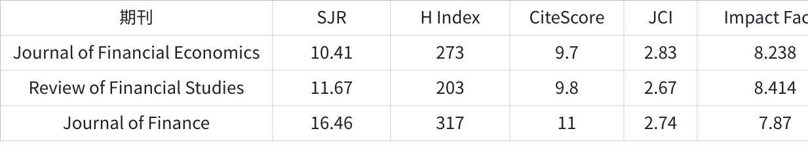

**点击图片可查看完整电子表格**

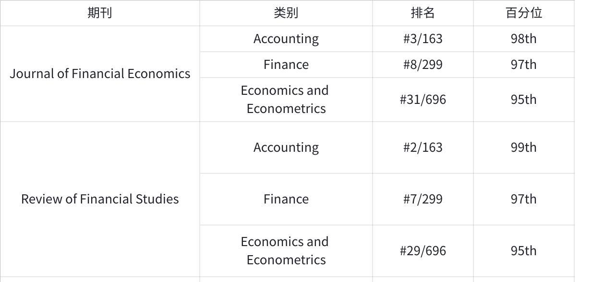

**点击图片可查看完整电子表格**

1.3 **背景介绍**

1.3.1 **学科**

期刊主要分类在Finance金融和Economics经济学中。

期刊名称代表的学科，Financial Economics，是金融经济学。

**金融经济学简介**

金融经济学是经济学的一个分支，分析市场资源的使用和分配。财务决策必须经常考虑未来事件，无论这些事件与个股、 投资组合还是整个市场有关。它运用经济理论来评估时间、风险、机会成本和信息如何对特定决策产生激励或抑制作用。金融经济学通常涉及创建复杂的模型来测试影响特定决策的变量。

这个经济学分支在很大程度上建立在微观经济学和基本会计概念的基础上。 它是一门使用计量经济学和其他数学工具的定量学科。金融经济学需要熟悉基本的概率和统计，因为这些是用于衡量和评估风险的标准工具。 金融经济学研究公允价值、风险和回报，以及证券和资产的融资。许多货币因素也被考虑在内，包括利率和通货膨胀。

跟传统经济学不同在于，传统经济学关注的是货币是一种，但只是一种，交易物品的交换。金融经济学专注于一种或另一种货币可能出现在交易双方的交换。 区别于传统经济学，他们关注时间、不确定性、选择权和信息在其中发挥作用的货币活动。

| 分类来源 | 分类 |  |
|---|---|---|
| ScienceDirect | Business，Management and Accounting Economics，Econometrics and Finance |  |
| JCR | BUSINESS, FINANCE\ ECONOMICS |  |
| Scopus/SJR | Business，Management and Accounting：Accounting Economics，Econometrics and Finance：Finance Business，Management and Accounting：Strategy and Management Economics，Econometrics and Finance：Economics and Econometrics |  |
| WOS | Business，Finance\ Economics |  |
1.3.2 **奖项**

期刊每年会通过投票授予论文两个奖项，分别是Jensen Prize和Fama-DFA Prize。这个两个奖项，正好代表了Financial Economics的两个主要分类。

**Jensen Prize**

以创刊者，Michael Jensen，命名。它授予最佳"公司金融和组织"（Corporate Finance and Organizations）论文。Jensen在1976年发表的《公司理论：管理行为、代理成本和所有权结构》 推动了这个领域的发展。

**Fama-DFA Prize**

以创刊者，Eugene Fama，命名。它授予最佳"资本市场和资产定价"（Capital Markets & Asset Pricing）论文。Fama 于2013年获得诺贝尔经济学奖，为资产定价领域的"有效市场"和"随机游走"假说做出巨大贡献。

期刊的编辑会列举出当年期刊发表的所有文章，并分成两个类别，然后由个人和学生订阅者投票得出。每个订阅者可以为每个类别投一票。每个类别提供一个一等奖和一个二等奖。一等奖获得\$5000奖励，二等奖获得\$2500美元奖励。1997年至今获奖文献清单见附录1。

其他发现

获奖文献，许多标题，都是有趣的标题，没有那么"学术"。比如，Betting against beta、Bubbles for Fama、Is momentum really momentum? Do liquidity measures measure liquidity?

JFE有一个分类号，G1资本市场和定价、G2金融机构和服务、G3公司金融和治理。其中，G1、G2主题，和Fama Prize对应，G3和Jensen Prize对应。

1.3.3 **创刊者**

**Michael C. Jensen**

《Journal of Financial Economics》1974年第一刊的主编（Editor）。

美国经济学家，他是哈佛大学Jesse Isidor Straus 工商管理名誉教授。1968年，获得芝加哥大学布斯商学院学位。

他非常高产，发表了100多篇论文。其中，最著名的作品是 1976 年他与William H. Meckling合著的论文，公司理论：管理行为、代理成本和所有权结构。截止2022年12月，根据他的学术贡献，经济学研究论文项目将他评为有史以来最具影响力的经济学家第51。

职业经历：

1967 年至 1988 年，罗彻斯特大学威廉·E·西蒙工商管理研究生院教授金融和工商管理，1977年至1988年，创建管理经济学研究中心，1984-1988 年被任命为 LaClare 金融和工商管理教授。

1985年，以半职形式加入哈佛商学院，1988 年全职任命，创立了谈判、组织和市场部门。1992 年到 1998 年，他在哈佛大学心脑行为倡议（Mind Brain Behavior Initiative）的指导委员会任职。2000年，学术工作中退休，保留了哈佛大学的荣誉退休身份。

1994年，共同创立了社会科学研究网络（SSRN）。

2000年-2007年，Monitor 任职组织战略实践部总经理。2007年-2009年，Monitor高级顾问。

协会&认证：

American Academy of Arts and Sciences 美国艺术与科学院院士

American Finance Association 美国金融协会前任主席（1992年）

奖项：

Fundacion BBVA 奖（2011 年）

Morgan Stanley-AFA （摩根士丹利美国金融协会）金融经济学卓越奖（2009年）

Financial Intermediation Society（金融中介协会）终身成就奖（2009 年）

Drexel U. LeBow College of Business 杰出学者奖 （2007 年）

Herber Simon Award 赫伯西蒙奖（2006年）

Tjalling C. Koopmans EFACT 会议奖（2004 年）

书籍：

《CEO 薪酬及其对策：恢复高管薪酬和资本市场关系的完整性》，哈佛商学院出版社，2002年

《公司理论：治理、剩余索取权和组织形式》，哈佛大学出版社，2000年

《组织战略的基础 》，哈佛大学出版社，1998 年

《公司金融的现代理论》McGraw-Hill，1984 年（编辑）

《危机中的民主》，哈佛商学院出版社，1977年

《资本市场理论研究》纽约：Praeger，1972 年（编辑）

研究兴趣：本体论模型。

**Eugene Fama**

《Journal of Financial Economics》1974年第一刊的联合主编（Co-Editor）。

2013 年诺贝尔经济学奖得主，被公认为"现代金融之父"。他的研究在学术界和投资界都广为人知。2013年，他与罗伯特·席勒、拉尔斯·彼得·汉森共同分享诺贝尔经济学奖，主要贡献理论为：Fama--French 三因素模型，有效市场假设。他的大部分研究都集中在风险与预期回报之间的关系及其对投资组合管理的影响上。他的工作改变了人们看待和进行金融的方式。有效市场成为金融经济学数十年实证研究的组织原则。

法玛是一位多产的作家，著有两本书，并在学术期刊上发表了 100 多篇文章。他是经济学中被引用次数最多的研究人员之一。 截止2022年12月，根据他的学术贡献，经济学研究论文项目将他评为有史以来最具影响力的经济学家第10。

他也是金融界三大奖项的首位获得者：德意志银行金融经济学奖（2005 年）、摩根士丹利美国金融协会卓越金融奖（2007 年）和奥纳西斯金融奖（2009 年）。

协会&认证：

2001年美国金融协会（American Finance Association）的第一个当选者

American Academy of Arts and Sciences 美国艺术与科学院院士

Econometric Society成员

奖项

Chaire Francqui（比利时国家科学奖）（1982 年）

德意志银行金融经济学奖（2005 年）

摩根士丹利美国金融协会，卓越金融奖（2007 年）

芝加哥商品交易中心创新奖颁发的 Fred Arditti 创新奖（2007 年）

奥纳西斯金融奖（2009 年）

诺贝尔经济学奖（2013年）

CFA 协会颁发的 Nicholas Molodovsky 奖（2006 年）

书籍

金融理论，德莱顿出版社，1972 年

金融基础：投资组合决策和证券价格，基础书籍，1976 年

研究兴趣：投资的理论和实证工作；资本市场的价格形成；企业融资。

**Robert C. Merton**

《Journal of Financial Economics》1974年第一刊的联合主编（Co-Editor）。

美国经济学家、诺贝尔经济学奖获得者、麻省理工学院斯隆管理学院特聘金融学教授，哈佛大学名誉教授。以对连续时间金融的开创性贡献而闻名，尤其是第一个连续时间金融期权定价模型，Black-Scholes-Merton 模型。1993年默顿与人共同创立了对冲基金长期资本管理公司。1997年默顿与迈伦·斯科尔斯因确定衍生品价值的方法获得诺贝尔经济学奖。

Merton 的研究重点是金融理论，包括生命周期金融、最佳跨期投资组合选择、资本资产定价、期权定价、风险公司债务、贷款担保和其他复杂的衍生证券。Merton 目前的学术兴趣包括金融创新和制度变迁动力学、控制宏观金融风险的传播以及改进衡量和管理主权风险的方法。截止2022年12月，根据他的学术贡献，经济学研究论文项目将他评为有史以来最具影响力的经济学家第89。

荣誉与奖项

1986 年，默顿成为美国艺术与科学院院士。

1986年，默顿担任美国金融协会主席。

1993年，默顿成为美国国家科学院院士。

1993 年，默顿获得了罗马国家科学院国际 INA - Accademia Nazionale dei Lincei 奖。

1993年，默顿获得国际金融工程师协会（后更名为国际量化金融协会）颁发的首届年度金融工程师奖。

1994 年，默顿成为国际金融工程师协会高级研究员。

1997 年，默顿成为金融定量研究所（"Q 组"）的杰出研究员。

1997 年，默顿因在股票期权方面的工作与迈伦·斯科尔斯一起获得诺贝尔经济学奖。

1998 年，默顿被哥伦比亚大学授予 Michael I. Pupin 国家服务奖章。

1999 年，默顿获得数学金融领域的终身成就奖。

2000 年，默顿成为财务管理协会的 FMA 会员。

2000 年，默顿成为美国金融协会研究员协会的会员。

2005 年，哈佛大学贝克图书馆为纪念他开设了默顿展览。

2009年，默顿获得麻省理工学院颁发的人文、艺术和社会科学罗伯特·穆赫奖。

2009 年，Merton 获得蒂尔堡大学颁发的 Tjalling C. Koopmans 资产奖。

2010年，默顿获得了伦敦大学颁发的柯尔莫哥洛夫奖章。

2010 年，默顿获得了爱尔兰皇家学院颁发的汉密尔顿奖章。

2011 年，默顿获得芝商所 Melamed-Arditti 创新奖。

2013年，默顿获得世界交易所联合会颁发的WFE卓越奖。

2014 年，默顿获得了金融中介研究协会颁发的终身成就奖。

2017 年，Merton 获得了墨西哥 Fundacion de Investigacion IMEF 颁发的 Finance Diamond Price。

图书：

《金融工程案例教师手册：金融创新的应用研究》，学徒堂Prentice Hall，1996年

《金融》，学徒堂Prentice Hall，2000年

《风险管理和国际金融脆弱性，卷4，日内瓦世界经济报告》，国际货币银行研究中心，2003 年

《衍生品原始资料，金融基础和趋势》，现代出版社，2006 年

《金融经济学 第二版》，学徒堂Prentice Hall，2009年

《金融经济学年度回顾，第 1 卷》，2009 年

研究兴趣：生命周期投资和退休基金、衡量和监测宏观金融系统性风险以及金融创新与金融机构不断变化的动态

参考文献：https://ideas.repec.org/top/top.person.all.html

1.3.4 **现任主编**

**Toni Whited**

Whited 于 1984 年以优异成绩从俄勒冈大学获得经济学和法语学士学位，并获得博士学位。

1990 年在普林斯顿获得经济学博士学位，与本·伯南克 (Ben Bernanke) 一起工作。Whited 在本科、MBA 和博士级别的金融、宏观经济学和计量经济学等广泛领域任教。

她在顶级经济和金融期刊上发表了 30 多篇文章。她的研究涵盖金融摩擦对企业投资的影响、计量误差的计量经济学解决方案、企业现金政策、动态模型的结构估计以及企业多元化等主题。

她曾因在《金融经济学杂志》上发表的一篇公司金融领域的顶级文章而获得詹森奖，并因在《金融杂志》上发表的一篇公司金融领域的顶级文章而两次获得布拉特尔奖。

她曾是《金融经济学杂志》的联合主编，并于2021年出任《金融经济学杂志》主编。

1.3.5 **历任主编**

JFE的历任主编对期刊贡献了大量高质量的论文。

| 姓名 | 任期 | H指数（WOS） | 本期刊发文数 （1974-2020） | 本期刊引用数/年 （1974-2020） | 主要研究主题 | 所在机构 | 高被引文 |
|---|---|---|---|---|---|---|---|
| M.C. Jensen | 1974-1996 | 26 | 3 | 174.7 | 资本资产定价模型、股票期权政策和公司治理的 | Harvard | [Theory of the firm: Managerial behavior, agency costs and ownership structure](https://www.webofscience.com/wos/woscc/full-record/WOS:A1976CJ65000001) [AGENCY COSTS OF FREE CASH FLOW, CORPORATE-FINANCE, AND TAKEOVERS](https://www.webofscience.com/wos/woscc/full-record/WOS:A1986C125500066) |
| John B. Long | 1983-1987 | 10 | 4.33 | 7.6 | 投资组合，现金流量，估值 | University of Rochester | [The numeraire portfolio](https://typeset.io/papers/the-numeraire-portfolio-2a4im07dxs) [Stock prices, inflation, and the term structure of interest rates](https://typeset.io/papers/stock-prices-inflation-and-the-term-structure-of-interest-17m12b5gh8) |
| G.W. Schwert | 1981-1986，1997-2021 | 56 | 6.33 | 42.6 | 资本市场、公司金融、公司控制、计量经济学、时间序列分析、预测和产业组织 | University of Rochester | [Expected stock returns and volatility](https://scholar.google.com/citations?view_op=view_citation&hl=zh-CN&user=0iBUM5wAAAAJ&citation_for_view=0iBUM5wAAAAJ:u5HHmVD_uO8C) [Why does stock market volatility change over time?](https://scholar.google.com/citations?view_op=view_citation&hl=zh-CN&user=0iBUM5wAAAAJ&citation_for_view=0iBUM5wAAAAJ:vV6vV6tmYwMC) |
| C.W. Smith | 1983-1987 | 10 | 6.83 | 59.7 | 公司金融政策、衍生证券和金融中介领域 | University of Rochester | [The investment opportunity set and corporate financing, dividend, and compensation policies](https://scholar.google.com/citations?view_op=view_citation&hl=zh-CN&user=fqyy9D4AAAAJ&citation_for_view=fqyy9D4AAAAJ:u5HHmVD_uO8C) [On financial contracting: An analysis of bond covenants](https://scholar.google.com/citations?view_op=view_citation&hl=zh-CN&user=fqyy9D4AAAAJ&citation_for_view=fqyy9D4AAAAJ:u-x6o8ySG0sC) |
| R.M. Stulz | 1983-1987 | 73 | 16.92 | 205.4 | 公司金融、公司治理、资产定价、金融机构和风险管理 | the Ohio State University | [Why Do US Firms Hold So Much More Cash than They Used To?](http://jiangnan.webvpn.jingshi2015.com:8181/http/77726476706e69737468656265737421e7e056d230356a5f781b8aa59d5b20301c1db852/wos/woscc/full-record/WOS:000270236200001) [Dividend policy and the earned/contributed capital mix: a test of the life-cycle theory](http://jiangnan.webvpn.jingshi2015.com:8181/http/77726476706e69737468656265737421e7e056d230356a5f781b8aa59d5b20301c1db852/wos/woscc/full-record/WOS:000239680700001) |
| J.B. Warner | 1987 | 28 | 5.67 | 77.3 | 共同基金、公司管理 | University of Rochester | [Why Do Mutual Fund Advisory Contracts Change? Performance, Growth, and Spillover Effects](http://jiangnan.webvpn.jingshi2015.com:8181/http/77726476706e69737468656265737421e7e056d230356a5f781b8aa59d5b20301c1db852/wos/woscc/full-record/WOS:000285999800009) |
| Toni M. Whited | 2021 - 至今 | 26 | 2 | 10.6 | 公司投资、公司现金政策、动态模型的结构估计、公司多元化和计量经济学解决方案 | University of Michigan | [How costly is external financing? Evidence from a structural estimation](http://jiangnan.webvpn.jingshi2015.com:8181/http/77726476706e69737468656265737421e7e056d230356a5f781b8aa59d5b20301c1db852/wos/woscc/full-record/WOS:000248726300006) [The Corporate Propensity to Save](http://jiangnan.webvpn.jingshi2015.com:8181/http/77726476706e69737468656265737421e7e056d230356a5f781b8aa59d5b20301c1db852/wos/woscc/full-record/WOS:000268058100007) |
备注：

1988年开始，有了Managing Editor和Editor之分。1988年之前，大家都是Editor，1988年之后，第一任Managing Editor为Jensen。

1.4 **信息网络**

文献数据来源：WOS、Dimension、SCISPACE、ScienceDirect、期刊综述

文献时间范围：1974年- 2022年

文献全部包含：论文、书评、讨论、社论、新闻、简讯、其他信息。

  ------------------- ----------------- ----------------- -----------------
  数据库              文献类型          时间              数量

  WOS                 全部              1976-2022         3430

  Dimension           全部              1974-2022         3661

  SCISPACE            全部              1974-2022         3325

  ScienceDirect       全部              1974-2022         4023

  期刊综述            论文              1974-2020         3003
  ------------------- ----------------- ----------------- -----------------

WOS只有1976-2022数据总计3430篇，包含论文、议事文件、较正、评论文章，缺少1974-1976数据，且部分论文缺失摘要。 用Dimension数据来看论文与摘要，bibliometrix仍用WOS数据。

WOS在1976-2023年间，具体文献分类及数量如下：

**点击图片可查看完整电子表格**

2\. **结论摘要**

2.1 **结论1：年少有为的变革者**

《金融经济学》是一个年少有为的变革者。

1976年创刊，和其他的经济学顶刊比，他还很年轻。年轻的他，顺应数学建模、假设检验技术、决策理论、计算机编程技术的快速发展，拥抱金融新兴力量对微观金融问题的研究，引领了金融经济学从旧式金融到现代金融的变革。

创刊至今，一直鼓励新的研究领域，从理论研究为主，到以实证研究为主，《金融经济学》也一直是自己的变革者。

2.2 **结论2：面向未来的探索者**

《金融经济学》是一个面向未来的探索者。

期刊的三位创刊者，为这种探索精神奠定了基础。在创刊时代，选择借助各学科新兴技术和理论，探索金融领域的新兴研究。Jensen、Fama和Merton都在各自细分领域，创造出了新的模型和方法，都是各自领域的现代理论奠基者。

期刊主动培养新兴研究领域，逐渐聚集了大量创新研究的学者。近些年，研究主题不再只是顺应时代变化，更是主动创新，面向未来，探索"未来金融"。

3\. **期刊发展历史**

3.1 **期刊发展起源与变化**

**起源：推陈出新---金融新兴力量向传统研究方式的变革**

20世纪70年代，分析方法、数学建模、假设检验技术、决策理论、运筹学研究和计算机编程技术等的快速发展则导致了金融经济学学科进入了一个全新的时代。

大量金融经济学研究开始由受过专门训练的金融学博士们来完成，这些新兴力量的学位论文多集中于微观金融问题研究，如资产组合理论、有价证券估值、复杂的金融契约、微观信息影响以及公司的投融资策略等。

但是由于主流期刊的观念尚未转变，仍旧偏好发布传统的货币理论、公共财政方面的文章，所以这些新兴力量的论文经常被主流期刊拒稿。

在《金融先驱》的一次访谈中，创刊人迈克尔·C·詹森透露了创办JFE期刊的原因：

在他还在攻读硕士学位时，与Fama等人一起合著了一篇 《The Event Study Paper》（金融领域的研究学者常使用事件研究法 (Event Study)的分析框架，研究某一特定事件发生对公司股票价格或收益率的影响，并以此检验金融市场对新信息披露的反应程度）。

但这篇论文被多个主流期刊都拒稿了，最终导致几人心血发布在一个不知名的期刊上。在他们看来，当时那些主流期刊的老家伙们并不懂得自己所做研究的价值，所以不会发表他们写的任何东西。为了解决这个问题，他们决定通过创办我们自己的期刊来解决这个问题。

在这样的背景下，《金融经济学杂志》 (JFE)面世了。

由于顺应了时代趋势，而且吸引了大量优秀的金融学新兴力量投稿，JFE的排名很快就与追赶上了当时最好的期刊，引领了金融经济学从旧式金融到现代金融的变革。

一本期刊的基调确立，往往与创始人的经历密切相关。

Michael C. Jensen在资本资产定价模型、股票期权政策和公司治理的学术讨论中发挥了重要作用。他开发了一种衡量基金经理业绩的方法，即所谓的詹森阿尔法。《金融经济学杂志》有一个奖项"詹森奖"就以其名字命名，它授予最佳"公司金融（Corporate Finance）"和"组织治理（Organizations）"论文。

Eugene Francis \" Gene \" Fama以其在投资组合理论、资产定价和有效市场假说方面的实证研究而闻名，被认为是有效市场假说之父。《金融经济学杂志》的Fama-DFA Prize奖项，就以其命名。它授予最佳"资本市场（Capital Markets）and "资产定价（Asset Pricing）"论文。

Robert Cox Merton研究重点是金融理论，包括生命周期金融、最佳跨期投资组合选择、资本资产定价、期权定价、风险公司债务、贷款担保和其他复杂的衍生证券。1997年默顿与迈伦·斯科尔斯因确定衍生品价值的方法获得诺贝尔经济学奖。

创刊者的重点研究领域和理念，也奠定了《金融经济学杂志》的主要研究主题和风格。

**阶段一：1974年---1980年，发展期**

**特征：由理论研究为主，发文量稳定增长**

所有学术期刊的成功都依赖于同行评审系统。但由于同一领域潜在审稿人在不同期刊中是通用的，不仅时间有限，也有一些审稿人需要自己同行评审中的大部分费用。

为了更快得到高质量的评论，从一开始，创刊人Michael Jensen就主张通过价格和反馈激励来影响裁判的行为。创刊初期，JFE 就利用不同激励机制来提高审稿人的工作效率：

报酬激励：为及时提交评审意见的审稿人提供投稿优惠，且审稿人的投稿机会不限次数。虽然这些报酬不能完全补偿审稿人的时间，但研究表明审稿人会优先审查 JFE 分配的稿件；

声誉激励：在期刊网站上公开审稿人员和平均审稿时间，为审稿人提供声誉奖励；

时间激励：对不合适的论文进行直接拒稿，减少了审稿人所需要的时间；

论文激励：因为熟悉论文的评价标准，担任 JFE 编辑或审稿人的作者往往拥有更低的拒稿率。

这一举措使得审稿人会优先评审JFE期刊的论文，也大大提高了期刊的审稿和发文速度，从而促使期刊投稿量和发文量显著增长。

JFE与其他财经期刊不同的另一项政策是努力突出和培养新的研究领域。通过举办专题讨论会、特刊、临床论文的方式，增加期刊影响力。

在研究范式上，70年代《金融经济学杂志》成立初期的研究以理论为主，几乎60% 的论文都是理论性的，基本上没有实证分析。

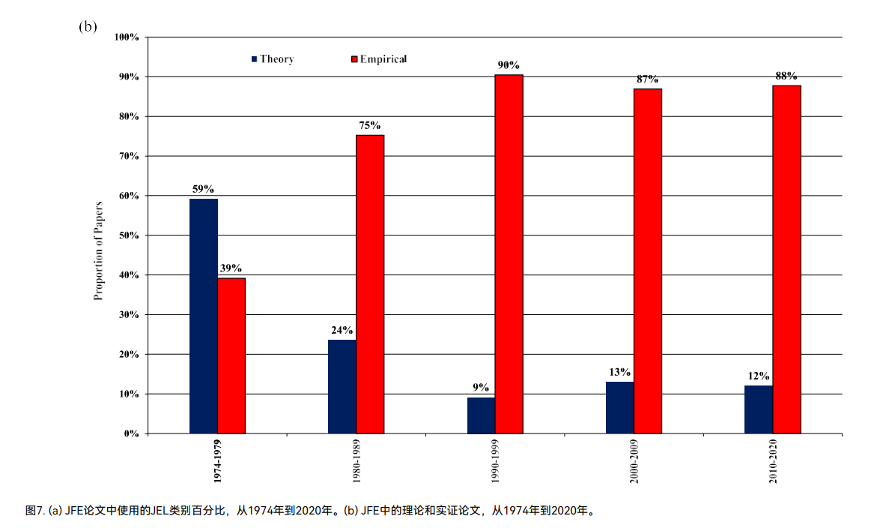{width="5.75in" height="3.40625in"}

这一阶段研究主题以资本市场和定价为主。

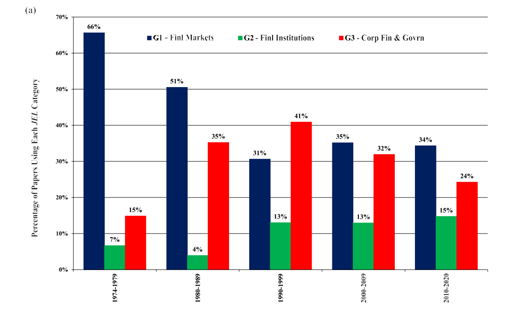{width="5.75in" height="3.5416666666666665in"}

**阶段二：1980年---至今，成熟期**

**特征：以实证研究为主，金融机构与服务、公司金融和治理主题占比上升**

随着计算机以及电子通信技术的进步，促进了实证研究和合作研究的发展，金融经济学家能够访问大量且不断增长的数据集合以了解金融研究主题。

再加上Michael Jensen一直要求理论家在他们的JFE 论文中包含来自他们模型的经验预测。所以到了80年代，JFE的研究范式变成了以实证论文为主。

同时，随着期刊投稿量的不断增加，编委会成员也不断优化和扩充，拒稿率较为稳定，审稿周期在 1996 年后稳定在 28 天左右，期刊逐渐步入成熟期。

在研究主题上， 80 年代期刊仍然主要以资本市场和定价为主；

不过在90年代，世界范围内先后爆发了日本经济危机、欧洲货币体系危机、东南亚金融危机金融危机等重大事件，促使学者研究金融机构在金融市场中所扮演的角色，所以90 年代以来与金融机构和服务有关的论文大幅增长。

与公司金融和治理有关的论文从 20 世纪 70 年代的六分之一增长到现在的三分之一以上。

参考文献：

《Pioneers in Finance: An Interview with Michael C. Jensen - Part 2》

《The remarkable growth in financial economics, 1974--2020 》G. William Schwert

《Journal of Financial Economics》---维基百科

3.2 **期刊发文量变化**

期刊从1995、1996年开始，年发文量逐渐增加，2012年达到了一个小高峰。2021年更是创了新高。

发现，这和期刊出版频率的变化相吻合。1995年，从曾经的季刊、双月刊，变为月刊至今。

期刊出版频率变化如下：

1974年，季刊形式发刊

1977年，变成两月刊

1978年，恢复季刊

1992年，恢复两月刊

1995年，开始逐渐转为月刊至今

其次，这个变化也可能和主编变化有关。

1997年，G.W. Schwert开始担任期刊主编，直到2021年。2021年期间，现任主编Toni Whited上任。

图：Annual Scientific Production

> 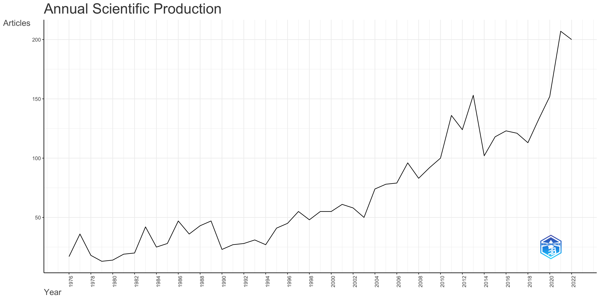{width="5.75in" height="2.875in"}

3.3 **期刊引用量变化**

期刊发文量和期刊被引量趋势完全不同。期刊发文量增长，并没有带来被引变化。

期刊被引高峰，1976年；小高峰，1993年。2000-2015年间比较平稳，2017年开始出现明显下滑。这些被引高峰，一般都跟当年出现爆款文献有关。比如，

1976年，有创刊者之一Jensen的《公司理论：管理行为、代理成本和所有权结构》。

1993年，有创刊者之一的Fama的《股票和债券回报率的共同风险因素》。

Average Citations Per Year

> 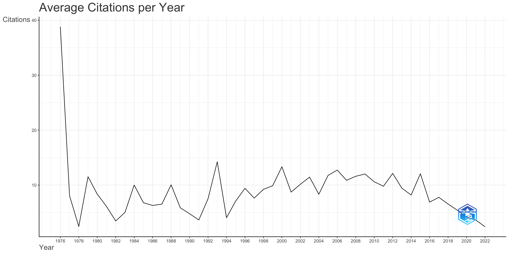{width="5.75in" height="2.875in"}

4\. **重要人物**

4.1 **不同阶段的重要学者**

4.1.1 **阶段划分**

参考Author\'s Production Over Time，如图所示，从文献数量看，时间大致可以分成4块。

1976-2015、1988至今、1996至今、2005至今。

图：Authors\' Production over Time - Top 20 各年份排序

> 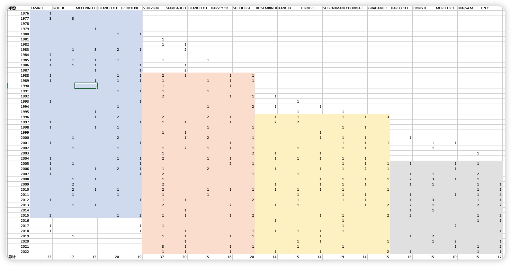{width="5.75in" height="2.9895833333333335in"}

4.1.2 **各阶段重要学者**

参考文献数量发布情况，每个阶段的重要学者如下。

**1976-2015：FAMA EF、FRENCH KR、DEANGELO H、ROLL R**

> FAMA EF和FRENCH KR，两个分别合作了三篇期刊高被引文献。其中，最高被引是他们1993年，共同提出的三因素模型，给资产定价领域带来重要转折。
>
> DEANGELO H的最高被引文献，是1980年提出的企业杠杆选择模型。
>
> ROLL R的最高被引文献，是1977年，对双参数资产定价理论的批判。

**1988至今：STULZ RM、HARVEY CR**

> STULZ RM的最高被引文献，是1990年，关于企业最优融资政策的探究。
>
> HARVEY CR的最高被引文献，是2001年的，关于企业融资的实证研究。

**1996至今：SUBRAHMANYAM A、GRAHAM JR**

> SUBRAHMANYAM A的最高被引文献，是2000年，关于流动性共性的实证研究。
>
> GRAHAM JR的最高被引文献，是2001年，关于官司财务的实证研究。

**2005至今：LIN C、HARFORD J、HONG H**

> LIN C，最高被引（作为第一作者），是2010年，关于股权结构与企业借贷成本的实证研究。
>
> HARFORD J，最高被引（作为第一作者），是2008年，关于美国的公司治理和公司现金持有量的实证研究。
>
> HONG H，最高被引，是2008年，关于社会规范对市场的影响的实证研究。

4.1.3 **主要学者共性**

由此发现，各阶段重要作者的重要文献，2000年以前，主要是提出某种理论模型或者对经典提出批判。2000年以后，主要来自特别的实证研究发现。

图：Authors\' Production over Time - Top 20

> 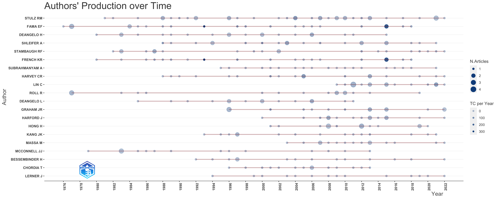{width="5.75in" height="2.2916666666666665in"}

4.2 **不同主题的重要学者**

4.2.1 **主题关系**

**2个共被引学者群组**

从共被引学者看，有两个学者群：

以Jensen为首，围绕「公司金融和组织」。

以Fama为首，围绕「资本市场和资产定价」。

以上，正好对应了该期刊的两大奖项。

**3个共被引文献群组**

从共被引文献看，有三个学者群：

红色群簇：围绕「所有权」「企业融资」「代理成本」「资本结构」方面相互关联。

绿色群簇：围绕「期权定价」「公司债务定价」「资产定价」「股权成本」方面相互关联。

蓝色群簇：围绕「CAPM」「三因素模型」「四因子模型」「五因素模型」等资产定价相关因素及模型的相互关联。

  ---------------------------------------------------------------------------- ---------------------------------------------------------------------------- ----------------------------------------------------------------------------
  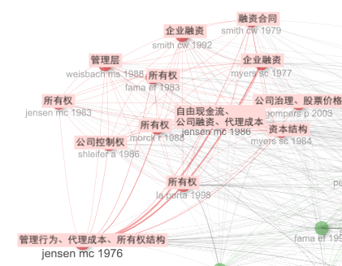{width="1.75in" height="1.3541666666666667in"}   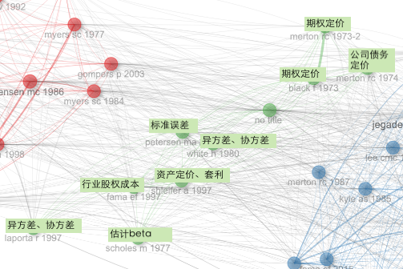{width="1.75in" height="1.1666666666666667in"}   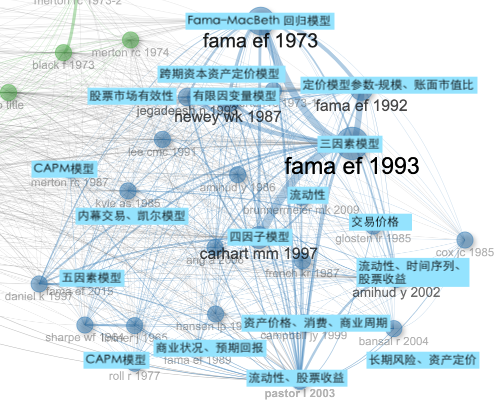{width="1.75in" height="1.3958333333333333in"}

  ---------------------------------------------------------------------------- ---------------------------------------------------------------------------- ----------------------------------------------------------------------------

图：Co_citationNetwork_Authors

> 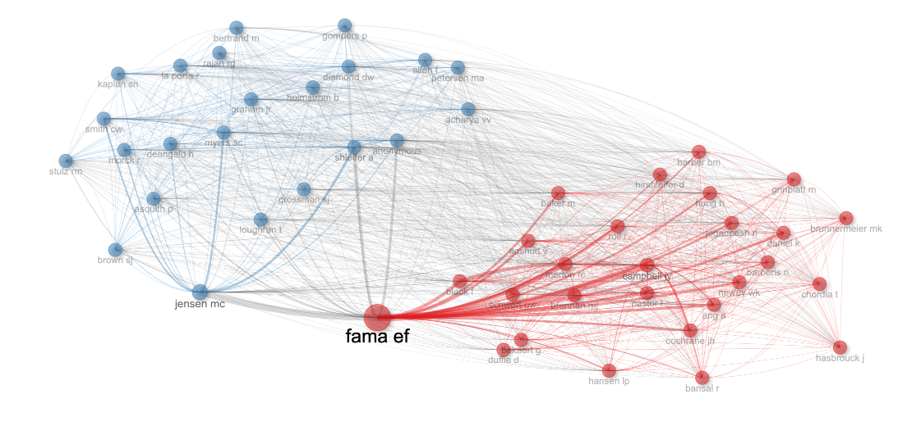{width="5.75in" height="2.75in"}

图：Co_citationNetwork_Papers

> 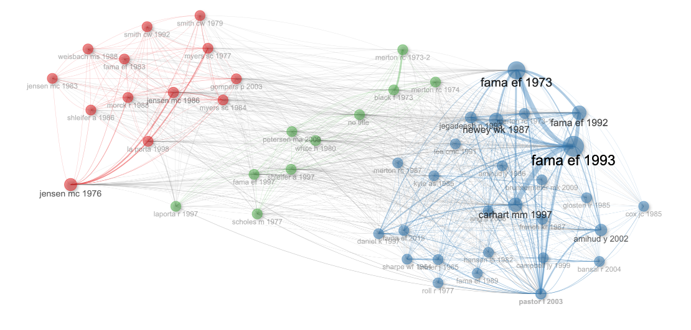{width="5.75in" height="2.75in"}

**6个Historiograph学者群组**

从historiograph，发现了6个学者群：

企业融资：JENSEN MC、SMITH CW、MYERS SC、ROCK K、ASQUITH P、MIKKELSON WH、JAMES C、MORCK R、STULZ RM、BENVENISTE LM、COMMENT R、YERMACK D、OPLER T、CORE JE、GRAHAM JR

资产定价模型：ROLL R、FAMA EF、BREEDEN DT、MERTON RC、KEIM DB、CAMPBELL JY、FRENCH KR、STAMBAUGH RF、COVAL J、NOVY-MARX R、FRAZZINI A

股票交易：SCHOLES M、DIMSON E、BROWN SJ、KEIM DB、MOELLER SB

预期回报：BANZ RW、GLOSTEN LR、AMIHUD Y、ACHARYA VV、LEWELLEN J

管理层变动：WARNER JB、WEISBACH MS

行为金融：BARBERIS N、FAMA EF

表：Historiograph_Network of JFE - 50node

> 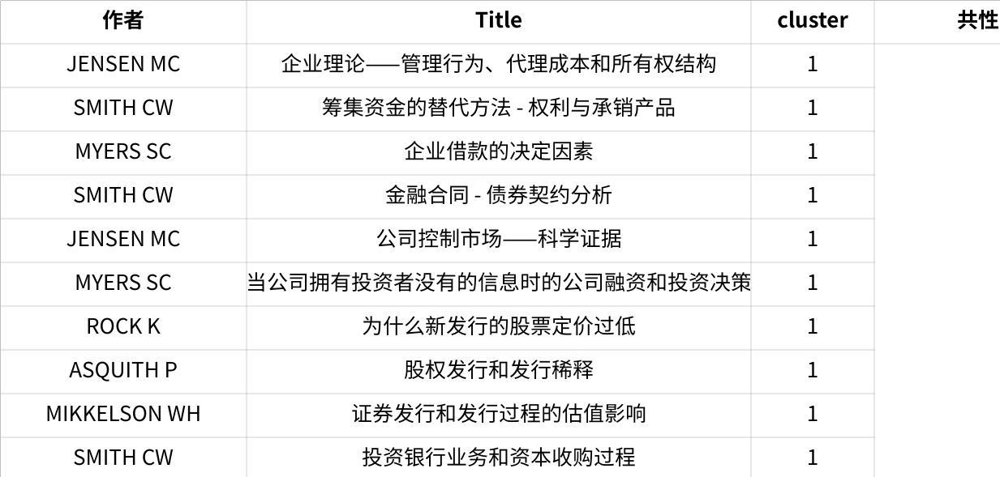
>
> **点击图片可查看完整电子表格**

4.2.2 **合作关系**

**9个合作网络群组**

根据Collaboration_Network 分析得出，共有九个合作群组。

**合作群组一**

> 主题：股票收益、债券
>
> 作者：smith cw、warner jb、bali tg、brickley ja、brown sj
>
> 文献例子：

使用每日股票收益 - 事件研究案例

金融合同 - 债券契约分析

衡量证券价格表现

**合作群组二**

> 主题：资本结构、股息政策、资本组合、生命周期理论、外国公司
>
> 作者：stulz rm、deangelo h、deangelo l、kang jk、masulis rw、karolyi ga、walkling ra、eckbo be、karpoff jm、shivdasani a、titman s
>
> 文献例子：

公司和个人税收下的最优资本结构

为什么在美国上市的外国公司更值钱？

股息政策和赚取/投入的资本组合：生命周期理论的检验

**合作群组三**

> 主题：股票、债券、预期收益、定价模型
>
> 作者：fama ef、stambaugh rf、french kr、schwert gw
>
> 文献例子：

股票和债券收益中的常见风险因素

五因素资产定价模型

预期股票回报率和波动率

**合作群组四**

> 主题：公司金融、支付政策、金融约束、金融危机
>
> 作者：harvey cr、graham jr、bekaert g、campello m
>
> 文献例子：

公司金融的理论与实践：来自实地的证据

21 世纪的支付政策

金融约束的实际影响：来自金融危机的证据

**合作群组五**

> 主题：流动性、资产定价、市场效率、股票收益
>
> 作者：subrahmanyam a、roll r、chordia t、brennan mj
>
> 文献例子：

流动性的共性

市场微观结构和资产定价：关于股票收益流动性不足的补偿

替代因子规格、安全特性和预期股票收益的横截面

流动性和市场效率

**合作群组六**

> 主题：金融杠杆
>
> 作者：mcconnell jj、kim eh
>
> 文献例子：

金融杠杆客户------理论和证据

**合作群组七**

> 主题：公司治理
>
> 作者：lin c、harford j
>
> 文献例子：

分析师对治理重要吗？来自自然实验的证据

**合作群组八**

> 主题：流动性风险、资产定价
>
> 作者：acharya vv、pedersen lh
>
> 文献例子：

具有流动性风险的资产定价

**合作群组九**

> 主题：资产定价
>
> 作者：zhou gf、shanken j
>
> 文献例子：

估计和测试 BETA 定价模型：替代方法及其在模拟中的性能

图：Collaboration_Network

> 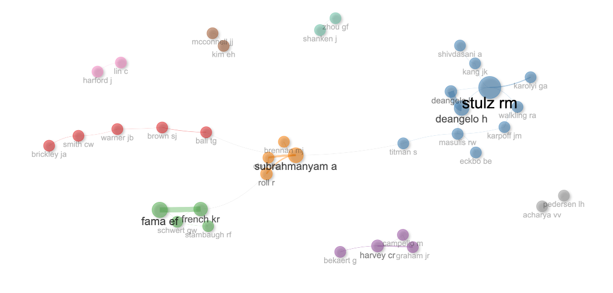{width="5.75in" height="2.75in"}

4.2.3 **师承关系**

**Merton Miller是Jensen和Fama的博士生导师**

**Merton Miller简介**

Merton Howard Miller，1923-2000）是一位经济学家。

1990 年，因在Modigliani-Miller理论，在公司金融方面的开创性研究而获得诺贝尔奖。

1961年开始在芝加哥大学任职。他曾担任美国金融协会主席，以及多家学术出版物和组织的顾问和编辑委员会成员。在他职业生涯的后期，米勒为银行和公司提供咨询服务，并在芝加哥期货交易所和芝加哥商品交易所担任董事职务。

关键文献

1958 年（与 Franco Modigliani），"资本成本、公司金融和投资理论 The Cost of Capital, Corporation Finance, and the Theory of Investment." 美国经济评论 48（6 月）：261--297。

1963 年（与 Franco Modigliani），"企业所得税和资本成本 Corporate Income Taxes and the Cost of Capital。" 美国经济评论 53（6 月）：433--443。

关键图书

1991年，金融创新和市场波动 Financial Innovations and Market Volatility。剑桥：布莱克威尔。

1997年，Merton Miller 论衍生品 Merton Miller on Derivatives 。纽约：威利。

4.2.4 **核心学者网路**

**Fama-French三因素模型及演变**

以Eugene Fama、Kenneth French为主，合作关系，奠定了三因素模型基础。

Eugene Fama、Kenneth French 在1992年，设计了三因素模型，用于描述股票收益。

Mark Carhart在1997年，提出了Carhart 四因子模型，作为Fama-French 模型的扩展，包含一个额外的动量因子(MOM)，即做多前一个月的赢家和做空前一个月的输家。

Foye、Mramor 和 Pahor 在2013年，提出了另一种三因素模型，该模型用一个因素代替股权成分的市场价值，避免会计操纵。

Fama 和 French在2015 年， 扩展了模型，增加了两个因素------盈利能力和投资。

Fama的前博士生Clifford Scott Asness提出了模型可以增加动量因子。Foye 在2018年，质疑了五因素模型在英国的有效性。

4.3 **重要学者背后的机构**

4.3.1 **高产机构**

最高产的机构前三，分别是NBER、Harvard University、University of Chicago。

**美国国家经济研究局**

美国国家经济研究局( NBER ) 是一家美国私人非营利研究机构，致力于在公共政策制定者、商业专业人士和学术界中开展和传播公正的经济研究。NBER以提供美国经济衰退的开始和结束日期而闻名。

NBER 的研究活动主要由 20 个不同主题的研究项目和 14 个工作组确定。研究项目有：老龄化、资产定价、行为/宏观、资本市场与经济、儿童、公司金融、美国经济发展、教育经济学、经济波动与增长、能源与环境、医疗保健、健康经济学、产业组织、国际金融与宏观经济学、国际贸易与投资、劳动研究、法经济学、货币经济学、政治经济学、生产力和公共经济学。

期刊历任主编中，Robert C. Merton、G. William Schwert 和 Rene M. Stulz等都是其成员。

**哈佛大学**

期刊创始人Jensen、Robert，先后在哈佛大学任教。

**芝加哥大学**

Merton Miller曾在芝加哥大学，分别担任Fama和Jensen，两位期刊创始人的博士生导师。随后，Gene Fama也在芝加哥大学任教。

芝加哥大学Booth商学院还设立了Fama-Miller Center，用于发展金融领域的学术研究。

图：Most Relevant Affiliations

> 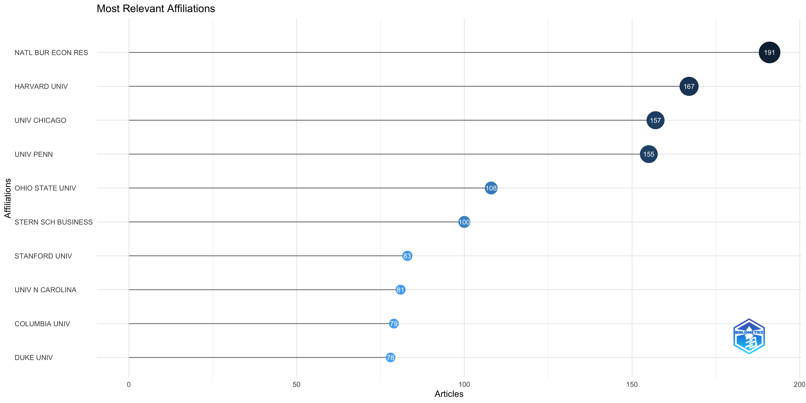{width="5.75in" height="2.875in"}

表：Most Relevant Affiliations

> 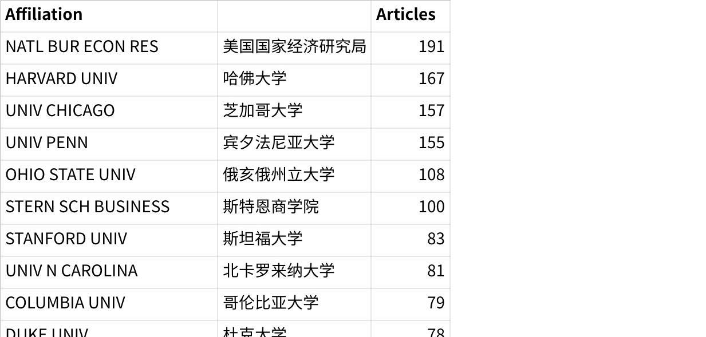
>
> **点击图片可查看完整电子表格**

4.3.2 **最有影响力的国家**

**学者最多**

学者主要来源美国、英国、加拿大。中国排第四，有92位。其中美国学者占了绝大多数。前文中的高产机构，绝大部分都是美国机构或者学校，也印证了这一现象。

图：Corresponding Author\'s Countries

> 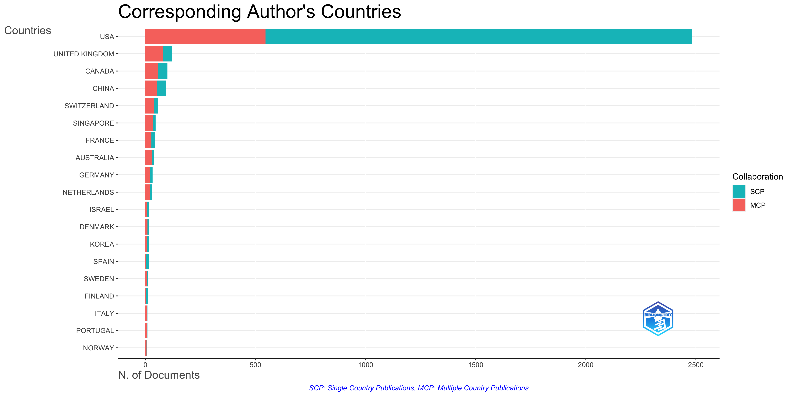{width="5.75in" height="2.875in"}

表：Corresponding Author\'s Countries

> 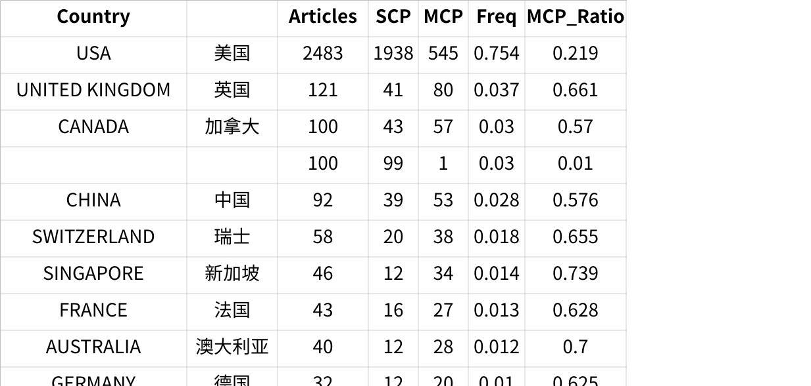
>
> **点击图片可查看完整电子表格**

**文献最多**

文献贡献数量看，美国依然第一，一骑绝尘。其次是英文、中国、加拿大。相比而言，中国学者虽然没有加拿大多，但整体更高产。

图：Country Scientific Production

> 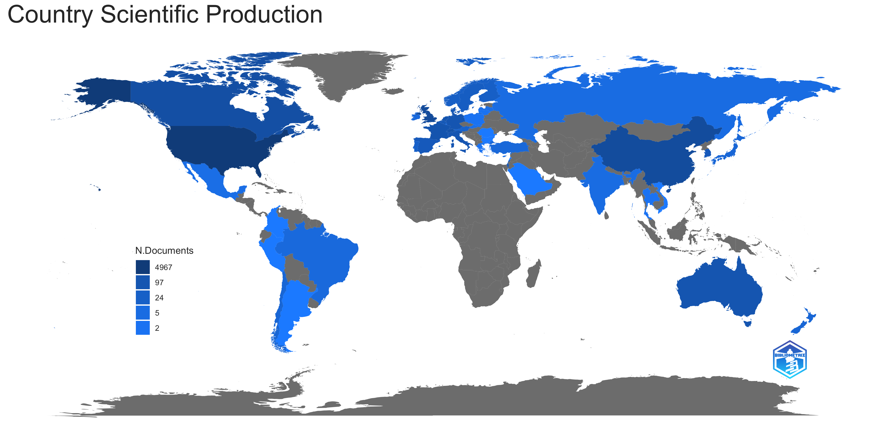{width="5.75in" height="2.875in"}

表：Country Scientific Production

> 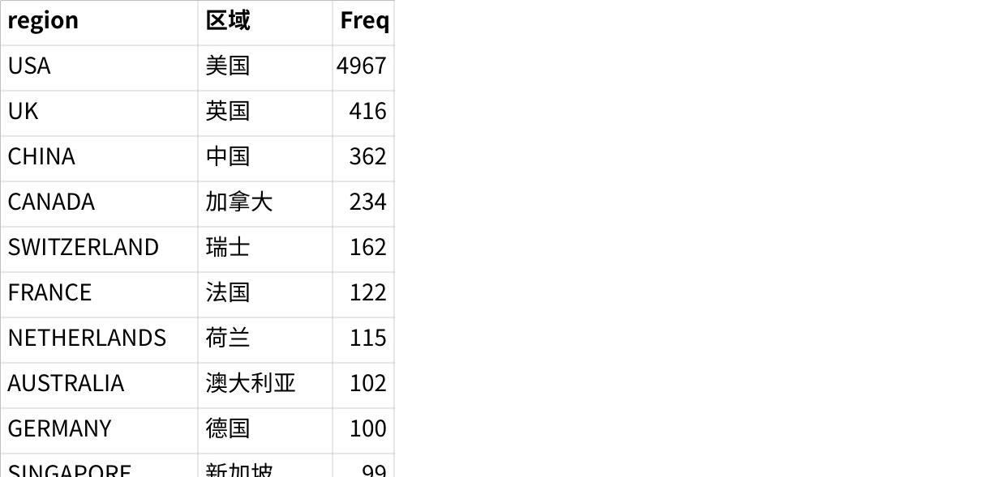
>
> **点击图片可查看完整电子表格**

**被引最多**

文献被引量最多的，依然是美国。其次，加拿大、中国、英国。由此看，加拿大虽然学者没那么高产，但文献质量高于中国和英国学者。

文献平均质量最高（文献平均引用数最高）的是以色列学者。

图：Most Cited Countries

> 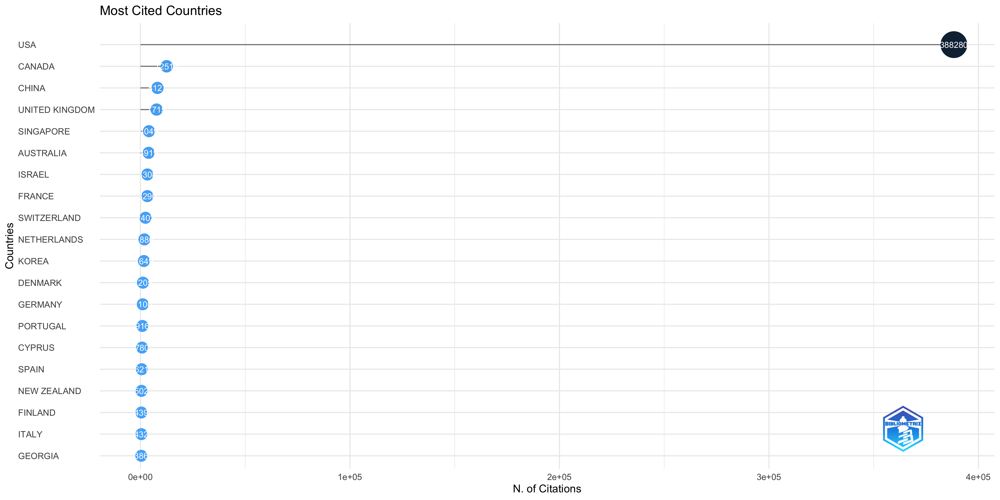{width="5.75in" height="2.875in"}

表：Most Cited Countries

> 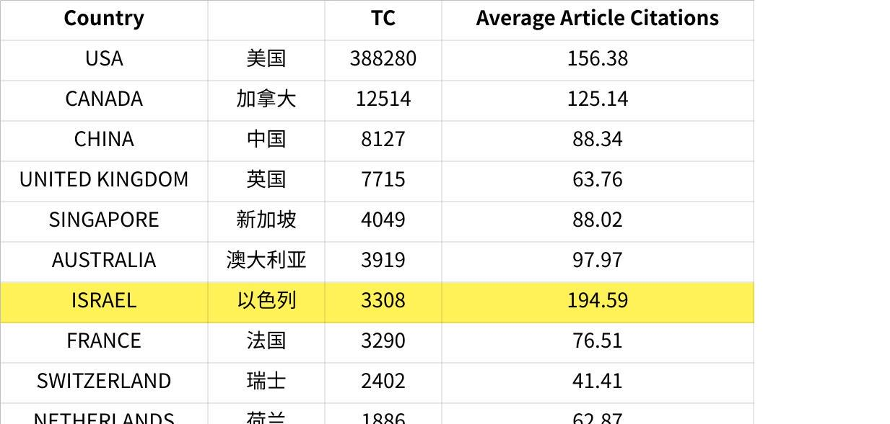
>
> **点击图片可查看完整电子表格**

4.4 **有影响力的学者**

4.4.1 **高H指数学者**

参考H指数，和期刊内被引数量，期刊内最有影响的作者，分别是René M. Stulz、Eugene F. Fama、Kenneth R French、Andrei Shleifer。其中，Kenneth R French的高引文献，主要是与Eugene F. Fama是合著，他为第二作者。

**René M. Stulz简介**

René M. Stulz 是俄亥俄州立大学银行和货币经济学 Everett D. Reese 主席以及金融经济学研究中心主任。他还曾在麻省理工学院、芝加哥大学和罗切斯特大学任教。

他获得了哈佛商学院的 Marvin Bower 奖学金、纳沙泰尔大学的荣誉博士学位以及全球风险专业人士协会的年度风险经理奖。2004 年，《财务与风险管理》杂志将他评为金融界最具影响力的 100 人之一。路透社将他列入了世界上最具影响力的科学家名单。

René M. Stulz 曾担任金融领域领先的学术刊物《金融期刊》的编辑长达 12 年，并担任《金融经济学期刊》的联合编辑长达 5 年。他是十多种学术和实践期刊的编委。此外，他还是国家经济研究局资产定价和公司融资项目的成员以及金融机构风险组的组长。

**Andrei Shleifer简介**

Andrei Shleifer 是哈佛大学 John L. Loeb 经济学教授。在 1991 年来到哈佛之前，他曾在普林斯顿和芝加哥商学院任教。Shleifer 的工作领域包括比较公司治理、法律和金融、行为金融学以及制度经济学。他出版了七本书，包括 The Grabbing Hand（与 Robert Vishny 合着）、Inefficient Markets: An Introduction to Behavioral Finance 和 A Crisis of Beliefs: Investor Psychology and Financial Fragility（与 Nicola Gennaioli 合着）以及一百多篇文章。

Shleifer 是《经济学季刊》的编辑，计量经济学会、美国艺术与科学院和美国金融协会的会员。1999年，Shleifer 获得了美国经济学会的 John Bates Clark 奖章。

图：Authors\' Local lmpact by H index

> 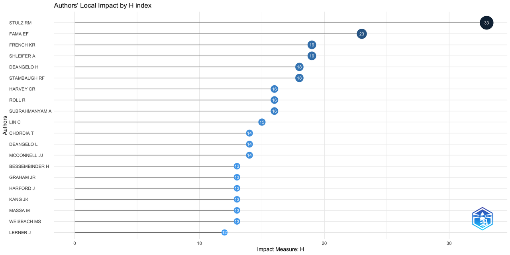{width="5.75in" height="2.875in"}

表：Authors\' Local lmpact by H index

> 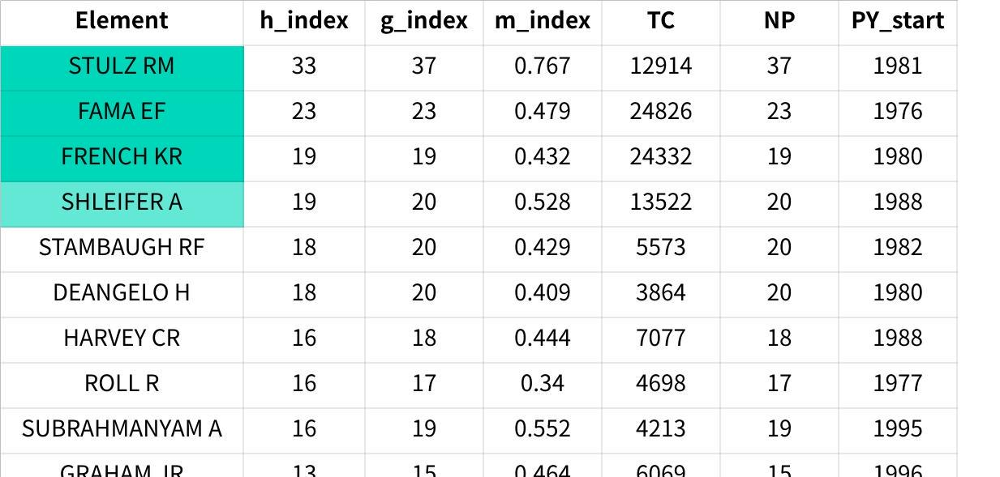
>
> **点击图片可查看完整电子表格**

图：Most Local Cited Authors

> 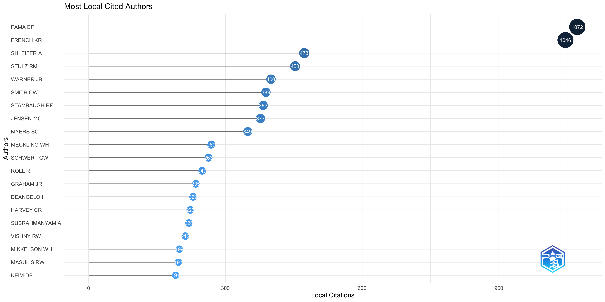{width="5.75in" height="2.875in"}

4.4.2 **高产学者**

参考期刊发文量排名，期刊内最高产的作者，分别是René M. Stulz、Eugene F. Fama、Harry DeAngelo、Andrei Shleifer。他们也都是高影响力、高被引作者，高量且高质。

**Harry DeAngelo简介**

Harry DeAngelo，任职南加州大学马歇尔商学院，担任 Charles E. Cook/社区银行主席。

他的研究重点是公司金融和公司治理问题，包括股息政策和财务困境、税收对资本结构和股息政策的影响、管理层收购对股东财富的影响、公司治理和股东投票权、委托书竞争的影响公司对管理任期和股东财富的控制，以及金融政治。

图：Most Relevant Authors - Top 20

> 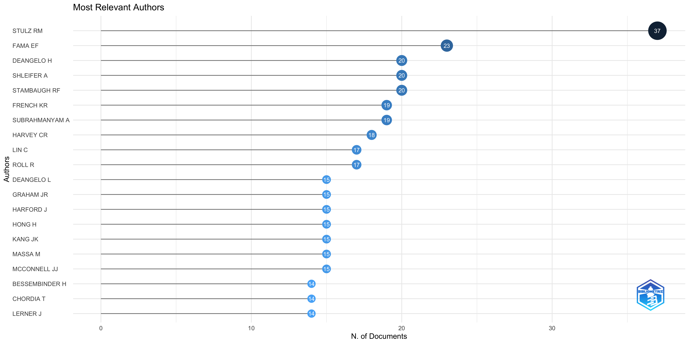{width="5.75in" height="2.875in"}

表：Most Relevant Authors - Top 25

> 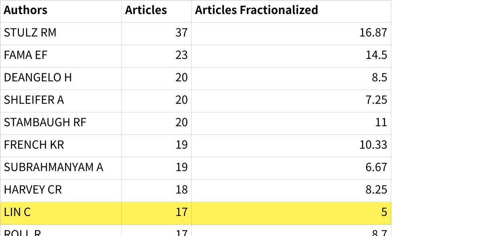
>
> **点击图片可查看完整电子表格**

4.4.3 **高价值学者**

参考期刊内学者的中介中心性，价值程度最高的分别是，Eugene F. Fama、Andrei Shleifer、Michael C. Jensen、Sanford J Grossman。

Jensen，虽然不算期刊高产和内部影响力高的学者，但他的价值非常高。

**Sanford** \" **Sandy** \" **Jay Grossman简介**

Grossman 是一位美国经济学家和专门研究量化金融的对冲基金经理。格罗斯曼的研究涵盖证券市场信息分析、公司结构、产权和最佳动态风险管理。他在领先的经济和商业期刊上发表了大量文章，包括《美国经济评论》、《计量经济学杂志》 、 《计量经济学》和《金融杂志》. 他在宏观经济、金融和风险管理方面的研究获得了无数奖项。

在沃顿商学院, Grossman 于 1989 年至 1999 年担任斯坦伯格金融学受托人教授（该头衔现已名誉退休），并担任沃顿商学院量化金融中心主任（1994 年至 1999 年）。他曾担任美国联邦储备系统理事会的经济学家( 1977-78)，并且是美国最大的期权和期货交易所芝加哥期货交易所的公共董事(1992-96)。

Co-citation_Network_Betweenness Top 10

> 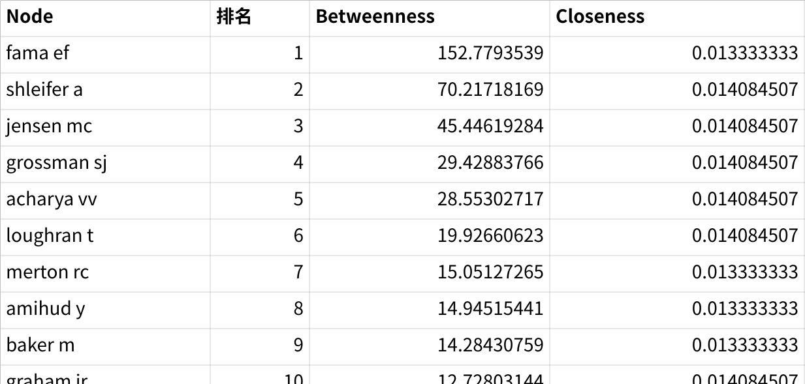
>
> **点击图片可查看完整电子表格**

4.4.4 **有趣的学者**

有趣度=价值程度➗传播程度。这次有趣度分析，以中介中心性作为价值程度参考，以期刊内引用量为传播程度参考。选取中介中心性高的学者，匹配他们的期刊内引用数据，然后用两种方式计算了有趣度：1、Betweenness➗TLC，2、中介排名分数➗引用排名分数。这个算法中，其实期刊内引用程度比较有局限性，答案只能做参考。比如，Fischer Black虽然有趣度分数高，但作为Black-Scholes或Black-Scholes-Merton 模型之一，他的实际传播程度可能没有真实反馈在公式中。故不适合作为有趣的学者。

综合发现有趣的学者，分别是Markus Brunnermeier、Tim Loughran、Sanford Grossman。

其中，Grossman是中介中心性高但被引极少的。

**Markus Brunnermeier简介**

(1969年3月22日－），经济学家，普林斯顿大学经济学教授，彼得森国际经济研究所客座高级研究员。他是普林斯顿大学经济系教员和本德海姆金融中心主任。

他的研究重点是国际金融市场和宏观经济，特别强调泡沫、流动性、金融危机和货币政策。他提倡流动性螺旋的概念、CoVaR 作为共同风险衡量指标、审慎悖论、金融主导地位、ESBies、逆转率、数字货币领域、再分配货币政策和货币理论。

他是或曾经是多个咨询小组的成员，包括国际货币基金组织、纽约联邦储备银行、欧洲系统风险委员会、德国联邦银行和美国国会预算办公室。他还是 CEPR、NBER 和 CESifo 的助理研究员。

表：学者有趣度计算

> 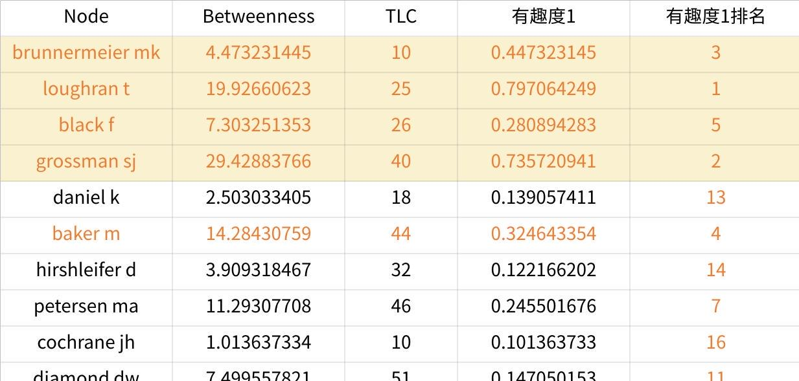
>
> **点击图片可查看完整电子表格**

4.5 **华人之星**

综上发现，有一个LIN C的学者，同时出现在了2005至今的重要学者、合作群组、期刊内影响力、高产学者中。发现他的历史发文最近十年比较多，检索发现，他确实是一个较为年轻的优秀华人学者。

**Chen Lin 林晨**

2000年获得华南理工大学工学学士，2004、2005、2006年分別获得美国弗洛里达大学工商管理硕士、经济学硕士和博士学位。

现任香港大学财务金融学讲席教授，并担任香港大学经济与工商管理学院副院长、香港大学金融创新和发展研究中心主任以及工商管理博士（DBA）项目主任等职。

他的研究兴趣包括银行与金融机构、公司金融、金融科技、创业与创新、金融与经济发展。

他的论文还获得了JFE2011年的Jensen Prize（一等奖）。

其他奖项，还包括JFE All Star论文，芝加哥量化联盟亚洲学术竞赛论文奖，CFA Institute和HKSFA颁发的香港亚洲资本市场研究奖，第九届国际会议最佳论文奖，第 31 届澳大利亚金融和银行会议 Bureau van Dijk 公司金融奖和第 31 届亚洲金融协会年会最佳论文奖。

他目前担任多家国际期刊的编委，包括《管理科学》、《银行与金融杂志》、《公司金融杂志》和《比较经济学杂志》。他曾受瑞典皇家科学院邀请提名诺贝尔经济学奖候选人。

他是许多 RGC 竞争性专项研究拨款的首席研究员。他曾为亚洲开发银行、国际清算银行、中国建设银行（亚洲）、香港金融发展局、前海创新研究院和世界银行提供咨询服务。他是加州大学伯克利分校哈斯商学院的金融、创业和创新杰出客座教授。他曾担任香港研究资助局和香港大学教育资助委员会进行的 RAE 活动的小组成员。他亦是香港外汇基金谘询委员会货币委员会成员、香港证券及期货事务监察委员会（证监会）金融科技谘询小组成员及香港金融管理局香港金融管理局咨询委员会成员及研究员。

他是非常高产的作者，合著偏多。根据学校主页显示，接下来还有11篇文献要出版。其中，要在JFE出版的有3篇。

参考文献：https://www.hkubs.hku.hk/people/chen-lin/

5\. **重要知识**

5.1 **研究演变回顾**

结合Trend Topics和共现分析，可以发现，期刊中的各个细分领域研究主题研究热度不会持续很久，很容易出现新兴研究话题。尤其是2000以后，大部分研究主题的热度，只能持续10年左右。

如果一个分支领域保持跨十年的热度，它的细分研究主题，会不断衍生新的分支。比如，公司治理、市场有效性的变化趋势。这也能看到，研究主题越来越多样化。

5.1.1 **每十年的研究演变**

将时间按照每十年一个阶段，大致分成1980-1989、1990-1999、2000-2009、2010-2022四个阶段。

根据文献标题词组和作者关键词的共现分析，主要有以下研究演变：

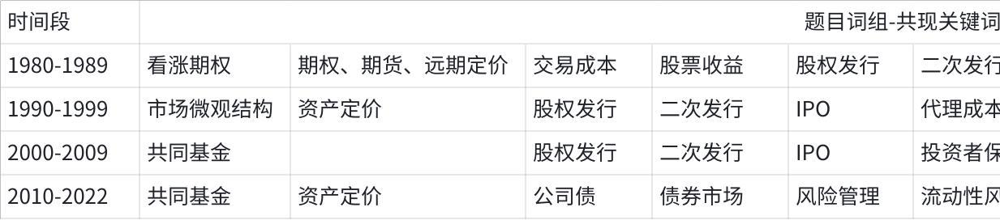

**点击图片可查看完整电子表格**

说明：共现分析时，发现作者关键词的共现分析，研究主题更细分。但作者关键词元数据缺失，只能生成1990年以后的数据，故不做为主要分析，仅做补充分析和交叉验证。

**产品类型**

从1980s关注衍生品（比如，期权、期货、远期）、股票，到2010s关注债券市场，尤其公司债。2000s开始，共同基金成为了热门研究。

**资产定价**

从1980s关注具体金融产品的定价，比如期权定价，到1990s后的资产定价，更偏向于投资标的定价。细分研究上，1980s关注交易成本，1990s转移到市场微观结构。

**企业融资**

从1980s关注股权发行、二次发行，到1990s、2000s增加关注IPO，再到2010s，转而关注发公司债、银行贷款的方式。

**公司治理**

1990以前，不太关注公司治理，1990s、2000s，二十年间，对公司治理尤为关注。其中，公司治理上，从1990s关注代理成本、公司表现，到2000s关注投资者保护、高管股票期权、现金持有量、内部资本等。

参考作者关键词共现分析，公司治理相关研究细分变化如下。由此发现，公司治理领域，研究越来越细致、具体、全面。从仅仅关注公司内部，到越发关注资本市场对公司

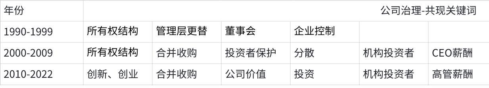

**点击图片可查看完整电子表格**

**风险管理**

2010年以前，风险相关研究，主要集中在公司金融&治理领域，关注企业内部风险。2010s才开始关注市场风险，金融危机、风险管理、流动性风险、信用风险都受到了重视。更关注债券市场和银行贷款两种投融资渠道的变化，也间接支撑了这个转变。

其中，流动性相关研究，细分变化如下，参考作者关键词共现分析。2000s，研究流动性本身，和市场、定价的关系，并没有特别关注流动性风险。2010s才增加关注相关风险的研究。这个转变，大概率和07-08年次贷危机有关。

**点击图片可查看完整电子表格**

**市场有效性**

题目词组中没有出现相关演变趋势。参考作者关键词共现分析，可以观察到以下细分变化。2000s以后，关注不再局限于微观结构，增加了更多人为和市场的不确定性分析，比如行为金融和市场异常，也开始增加更宏观的货币政策研究。

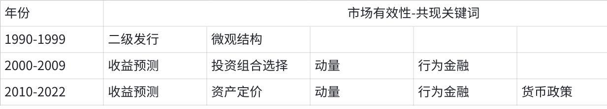

**点击图片可查看完整电子表格**

表：每10年的词频共现分析-1980-1989年 - 题目词组

> 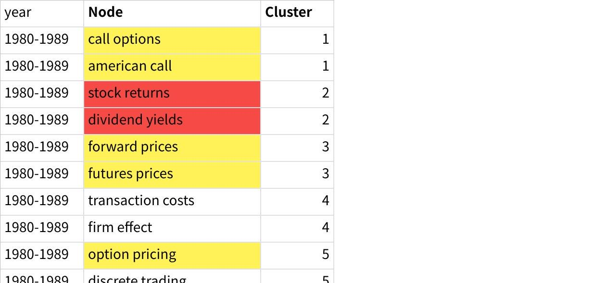
>
> **点击图片可查看完整电子表格**

图：每10年的词频共现分析-1980-1989年 - 题目词组

> 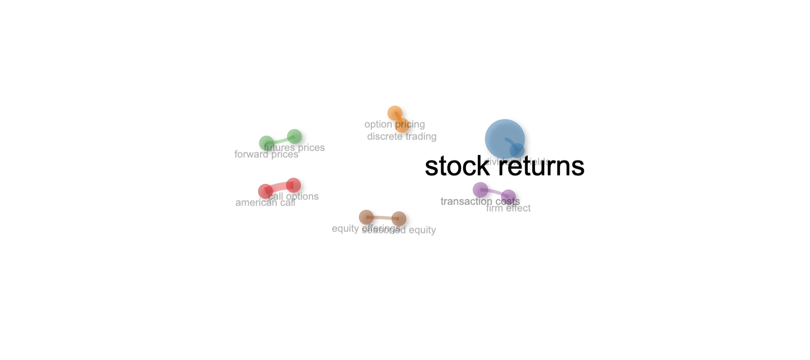{width="5.75in" height="2.5520833333333335in"}

表：每10年的词频共现分析-1990-1999年 - 题目词组

> 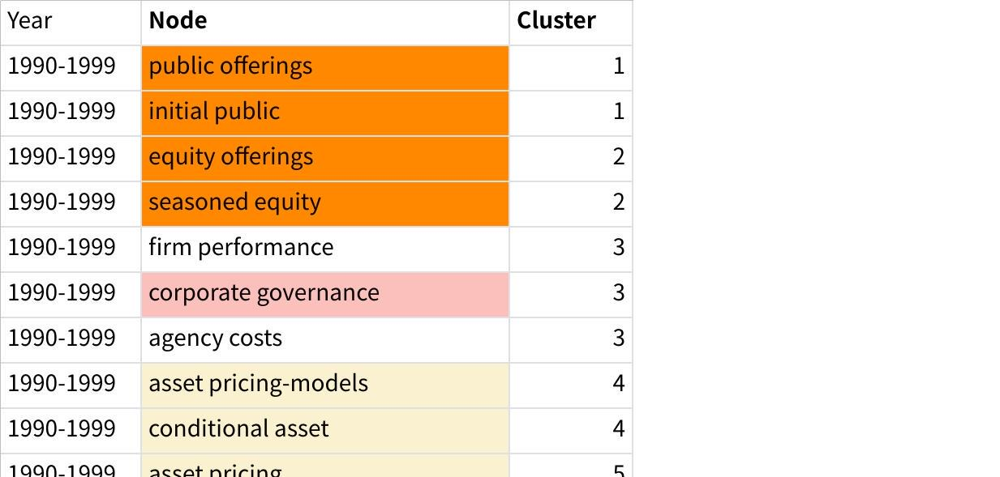
>
> **点击图片可查看完整电子表格**

图：每10年的词频共现分析-1990-1999年 - 题目词组

> {width="5.75in" height="2.40625in"}

表：每10年的词频共现分析-2000-2009年 - 题目词组

> 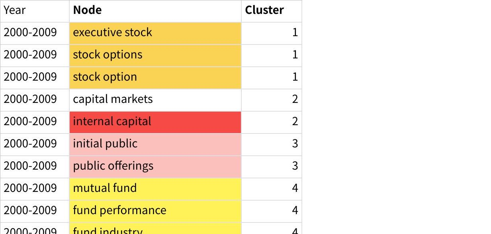
>
> **点击图片可查看完整电子表格**

图：每10年的词频共现分析-2000-2009年 - 题目词组

> {width="5.75in" height="2.40625in"}

表：每10年的词频共现分析-2010-2022年 - 题目词组

> 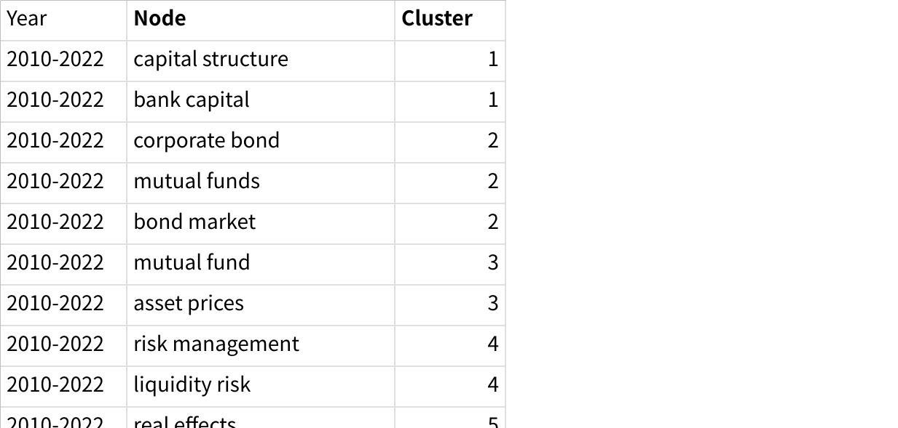
>
> **点击图片可查看完整电子表格**

图：每10年的词频共现分析-2010-2022年 - 题目词组

> 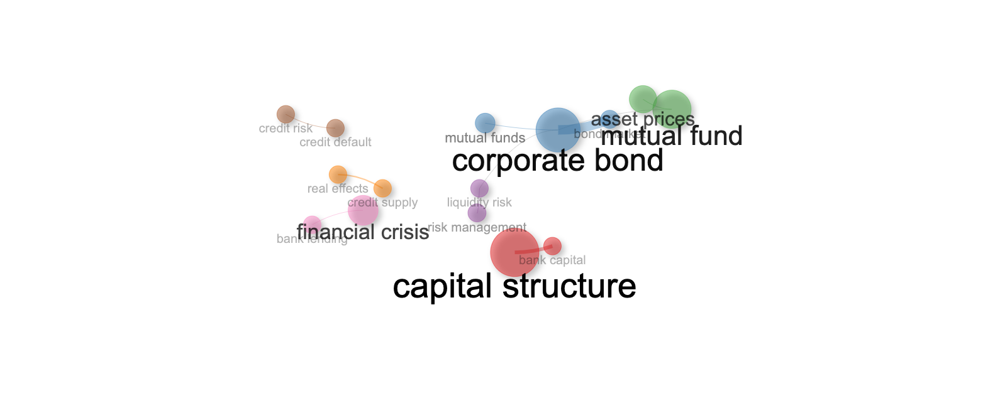{width="5.75in" height="2.40625in"}

每10年的词频共现分析-1990-2022年 - Author\'s Keywords

> 表：每10年的词频共现分析-1990-1999年 - Author\'s Keywords
>
> 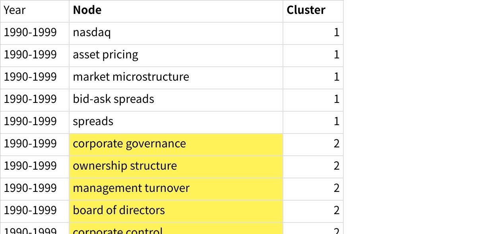
>
> **点击图片可查看完整电子表格**
>
> 图：每10年的词频共现分析-1990-1999年 - Author\'s Keywords
>
> 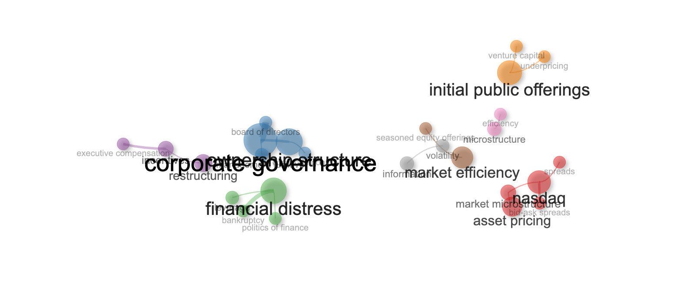{width="5.75in" height="2.40625in"}
>
> 表：每10年的词频共现分析-2000-2009年 - Author\'s Keywords
>
> 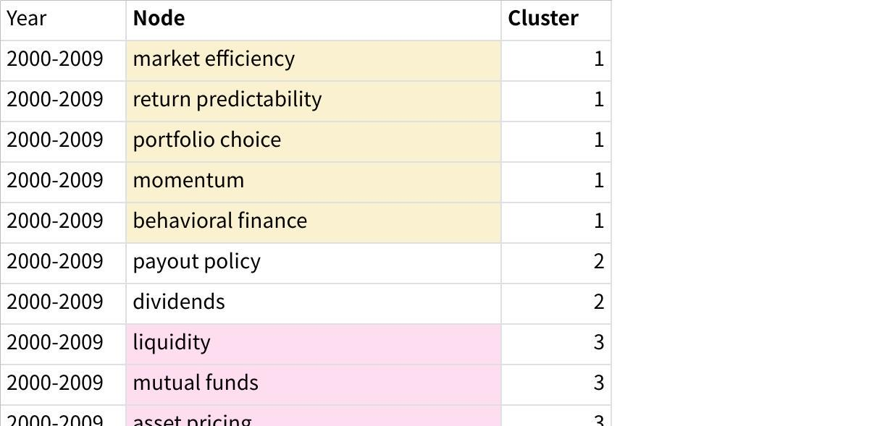
>
> **点击图片可查看完整电子表格**
>
> 图：每10年的词频共现分析-2000-2009年 - Author\'s Keywords
>
> 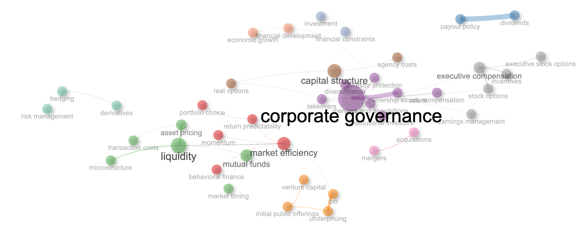{width="5.75in" height="2.40625in"}
>
> 表：每10年的词频共现分析-2010-2022年 - Author\'s Keywords
>
> 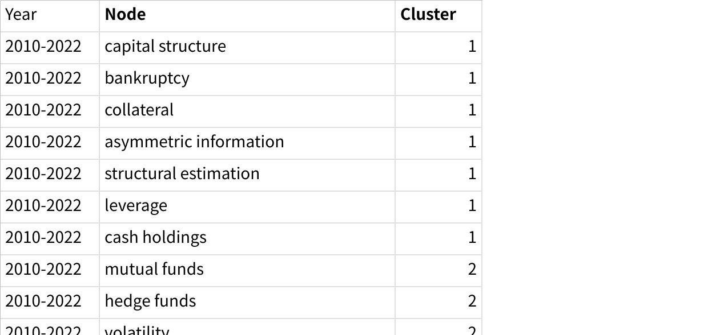
>
> **点击图片可查看完整电子表格**
>
> 图：每10年的词频共现分析-2010-2022年 - Author\'s Keywords
>
> 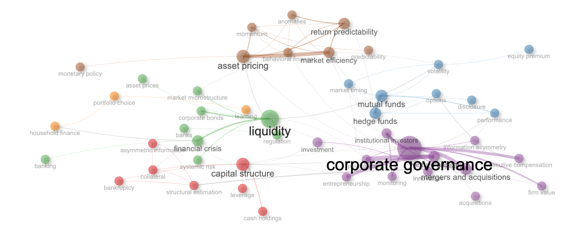{width="5.75in" height="2.40625in"}

5.1.2 **主题演变**

**两组研究重点转移**

从Thematic Evolution发现，两组研究重点转移。

公司金融和组织领域的学者，过去研究财务危机、资本结构、IPO、合并的，研究重点有逐渐转移到企业治理的趋势，并保持这个领域的研究。这个话题直到2016年，都是热门。

研究过去研究资产定价、市场有效性的，逐渐转移到流动性，并保持这个领域研究。这个话题直到2018年，都是热门。

**次贷危机的影响**

从Thematic Evolution发现，

2007年以后，研究焦点慢慢集中到资产定价、共同基金、资本结构上。市场有效性，不再如过去那么备受关注。

2006年以前，研究的主题比较分散，到了2007至今，明显集中很多。

公司金融和组织，集中在了资本结构、公司治理上。

资本市场和资产定价，集中在了共同基金上。

2007年开始，流动性，成了一个研究主流。流动性、破产、银行、合并收购，都成了热门话题。这可能和2007-2008年的次贷危机相关。相信也是经历了2007年次贷危机之后，大家流动性的重视明显增加。

次贷危机（或者说08金融危机）后，2011年、2012年，热门研究主题新增了抵押品、金融危机。

**次贷危机简介**

全名次级房屋借贷危机（Subprime mortgage crisis），是由美国国内抵押贷款违约和法拍屋急剧增加所引发的金融危机，重大影响到全球各地银行与金融市场。

次贷危机以2007年4月美国第二大次级房贷公司新世纪金融公司破产事件为"标志"，由房地产市场蔓延到信贷市场，许多金融机构和他们的客户损失惨重，进而演变为全球性金融危机，成为了21世纪初世界经济大衰退的一个重要部分，并引发2008年金融海啸（或称2008年世界经济危机）。

金融危机的原因众说纷纭，一般认为有：系统风险低估、道德风险、评级机构失职以及金融监管缺位等。

图：Thematic Evolution（Author\'s Keywords） - Time Cutting - 1998-2006

> 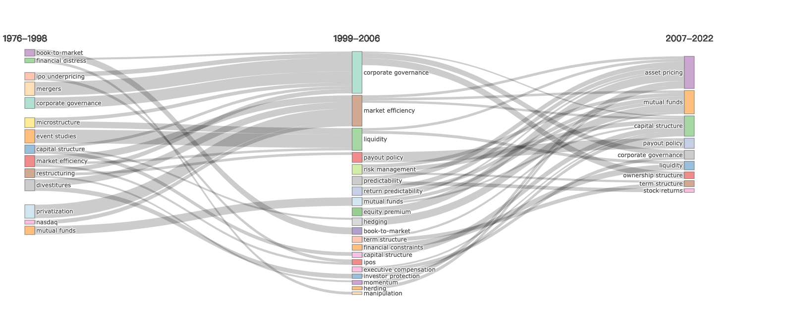{width="5.75in" height="2.40625in"}

说明：选择1998、2006，因为表中看到，1998、2006有一个相对明显的分水岭，还有2020，但时间太近了，暂不区分。

5.2 **有影响的知识**

5.2.1 **被研究最多的**

**最高频的关键词**

从公司金融和组织领域（Jensen Prize）看，

公司治理（corporate governance）、资本结构（capital structure）、高管薪酬（executive compensation）、收购合并（mergers&acquisitions）、首次公开发行（IPO）、所有权结构（Ownership Structure）被研究最多。

从资本市场和资产定价领域（Fama-DFA Prize）看，

流动性（liquidity）、资产定价（asset pricing）、共同基金（mutual funds）、市场有效性（market efficiency）、收益预测（return predictability）、风险投资（venture capital）、对冲基金（hedge funds）、机构投资者（institutional investors）、金融危机（financial crisis）、股票收益（stock returns）、期限结构（term structure）、公司债（corporate bond），被研究最多。

相比较而言，公司金融和组织领域，研究话题更为集中；资本市场和资产定价领域，研究更多样。

图：Most Frequent Words of JFE - 30 - Author\'s Keywords

> 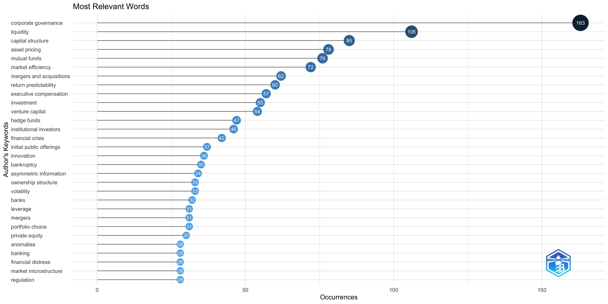{width="5.75in" height="2.875in"}

图：Most Frequent Words - 30 - Title

> 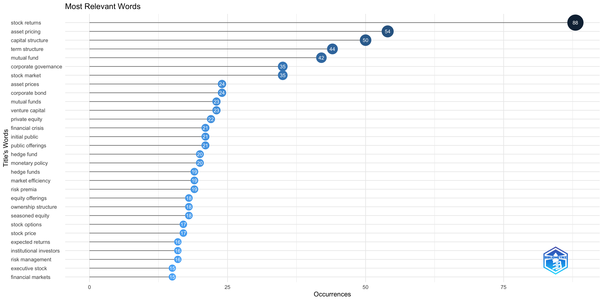{width="5.75in" height="2.875in"}

**TreeMap**

整个期刊文献中，研究最多的主题分别是，公司管理（Corporate Governance）、流动性（Liquidity）、资本结构（Capital Structure）、资产定价（Asset Pricing）、共同基金（Mutual Funds）、市场有效性（Market Efficiency）。

其中，公司管理和资本结构，是公司金融和组织领域的主要研究主题。

流动性、资产定价、共同基金、市场有效性，是资本市场和资产定价领域的主要研究主题。

图：TreeMap of JFE

> 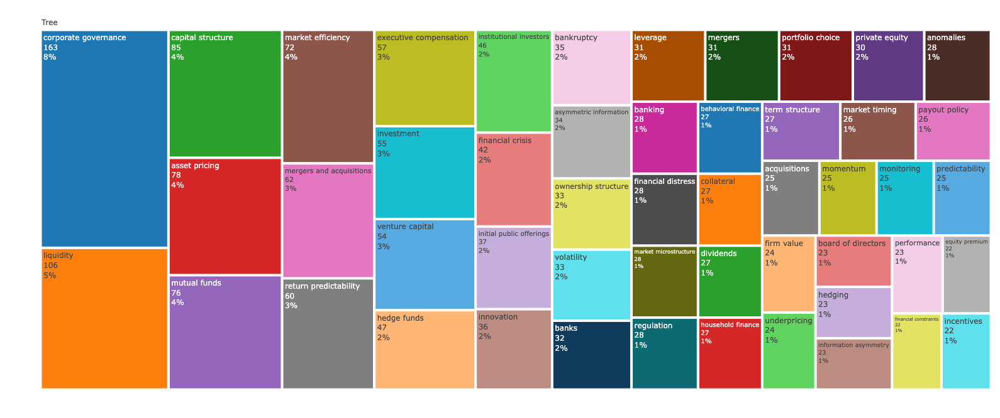{width="5.75in" height="2.40625in"}

5.2.2 **被引用最多的**

JFE期刊内被引多的文献，整个金融经济领域被引也多。在整个领域引用多的，在期刊内相互引用不一定太多。

**三个关键作者和理论**

其中，总引用和期刊内引用前四的文献，是一致的，并且和其他文献影响力差别较大。这意味着这四篇文献非常重要，也反映了期刊在这四个主题下的影响力。

其中，两位都是期刊的创始者。

Jensen提出的关于管理行为、代理成本和所有权结构的理论，在公司金融和组织领域影响极大。其中，关于所有权结构的研究，期刊在1990-2009的二十年间，一直都是热门研究主题。\
Fama提出的关于股票和债券回报率的理论，在资本市场和资产定价领域影响极大。其中，Fama-French的股票市场三因素模型是资产定价领域的重要模型。\
\
有两篇文献来自同一作者，Stewart C. Myers。他提出的公司融资相关理论，在公司金融领域影响大。

**Stewart C. Myers 简介**

Myers是麻省理工学院斯隆管理学院的Robert C. Merton（1970）金融学名誉教授。

Myers 是美国金融协会的前任主席、美国国家经济研究局的助理研究员和 Brattle Group, Inc. 的负责人。他的教科书《公司金融原理》（第 12 版，与 Richard Brealey 和 Franklin Allen 合作）广为人知堪称财务管理的"圣经"。

他的研究重点是实物资产和金融资产的估值、公司金融以及政府对企业监管的财务方面。他引入了资本结构的权衡理论和啄食顺序理论，并且是第一个认识到实物期权在公司融资中的重要性的人。

**学术影响力大的领域**

被引前十的文献中，公司金融和组织领域，主要集中在管理层所有权、公司融资。资本市场和资产定价领域，主要集中在股票（包括股权期权）相关定价上。

表：Most Global Cited Documents of JFE

> 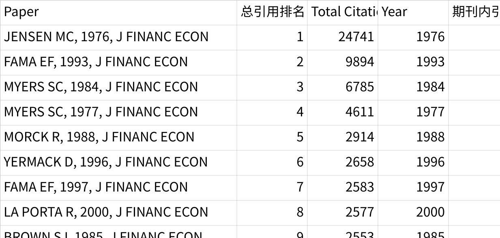
>
> **点击图片可查看完整电子表格**

表：Most Local Cited Documents of JFE

> 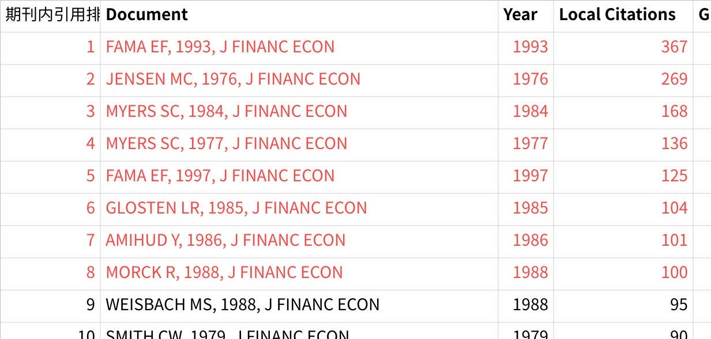
>
> **点击图片可查看完整电子表格**

图：Most Global Cited Documents of JFE

> 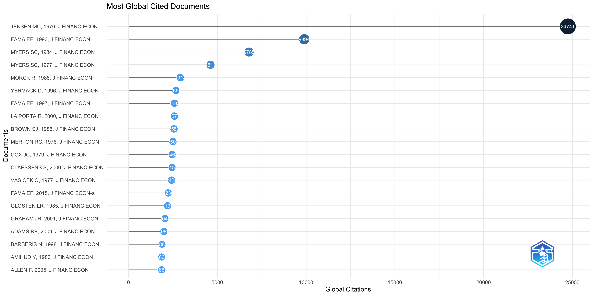{width="5.75in" height="2.875in"}

图：Most Local Cited Documents of JFE

> 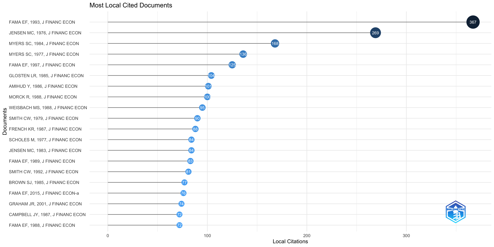{width="5.75in" height="2.875in"}

5.2.3 **被反驳最多的**

期刊中文献整体被反驳不多，被反驳多的文献大多也是被引多的文献。

其中，反驳最多的文献（反驳数＞30），有两篇都和Fama的资产定价模型有关（三因素模型和五因素模型）。这个模型学术影响力大，且颇具争议性，很值得关注。

Fama、Eugene 和 French，Kenneth，（1993 年），股票和债券回报率中的常见风险因素，金融经济学杂志，33，第 1 期，第 13 页。3-56

Fama, Eugene F. 和 French, Kenneth R.，(2015)，五因素资产定价模型，金融经济学杂志，116，第 1 期，p. 1-22

还有三篇，都和研究「企业价值」相关。分别研究管理层、所有权与董事会，对企业价值的影响。

表：Most Contrasting Documents of JFE By Scite

> 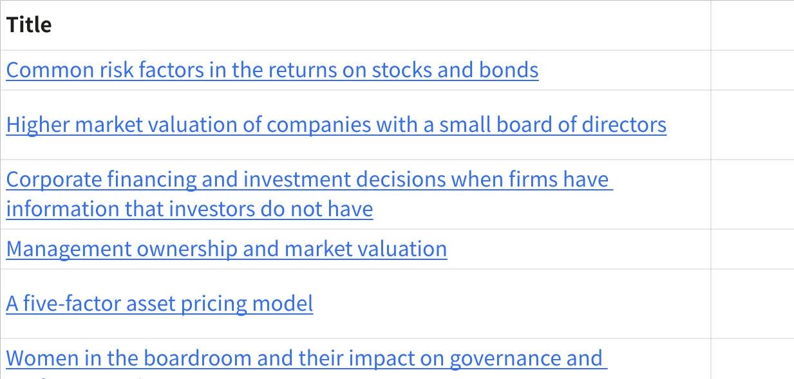
>
> **点击图片可查看完整电子表格**

5.3 **可能的研究趋势**

5.3.1 **Trend Topics**

2014年开始，最近几年兴起的热门话题，包含结构估计（Structural Estimation）、家庭金融（household finance）、创业创新（entrepreneurship、innovation）、货币政策（monetary policy）。

**家庭金融（Household finance）**

主要是资本市场投资领域的新兴热门主题。它是研究家庭如何使用金融工具和市场来实现目标的金融经济学领域。主要分为标准家庭金融（Normative household finance）和积极家庭金融（Positive household finance）。

标准家庭金融，主要研究家庭应如何通过构建生命周期内最优投资组合选择和融资决策模型来做出财务决策。

积极家庭金融，主要根据经验调查，研究家庭实际用钱做什么以及他们如何借钱。

根据共现网络分析发现，家庭金融和组合投资选择（portfolio choice）、金融危机（financial crisis）研究紧密相关。

**结构化估算（Structural estimation）**

主要是公司金融领域的新兴热门主题。结构估计是一种估计经济模型参数和评估模型拟合度的尝试，用以确定模型隐含的最优决策是否与公司的实际决策相似。

参数一般包括：偏好参数（Preference parameters）、技术参数（Technology parameters）、其他不随时间变化的机构特征（Other time-invariant institutional features）

**创新创业（entrepreneurship、innovation）**

主要是公司金融和组织领域下的新兴主题，主要研究创业融资（entrepreneurial finance）中的融资创新、创业融资给企业带来的影响。

**货币政策（monetary policy）**

主要是中央银行制定的宏观经济政策。它涉及货币供应量和利率的管理，是一国政府为实现通货膨胀、消费、增长和流动性等宏观经济目标而采取的需求侧经济政策。跟其他几个新兴热门主题偏微观经济不同，这是偏宏观经济的。研究主题再次回归到宏观经济上，这也许和近二三十年，越发频繁的金融危机事件有关。

表：Trend Topics of JFE

> 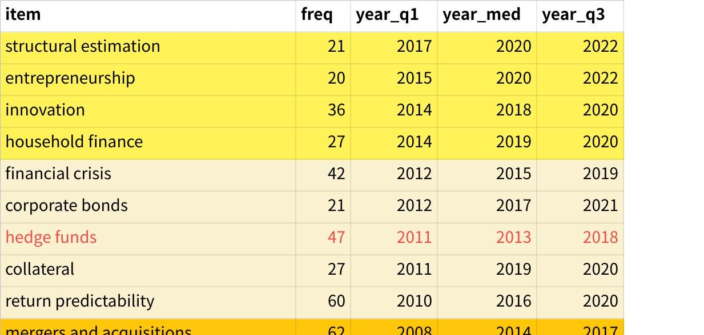
>
> **点击图片可查看完整电子表格**

图：Trend Topics of JFE（Author\'s Keywords），参数同表

> 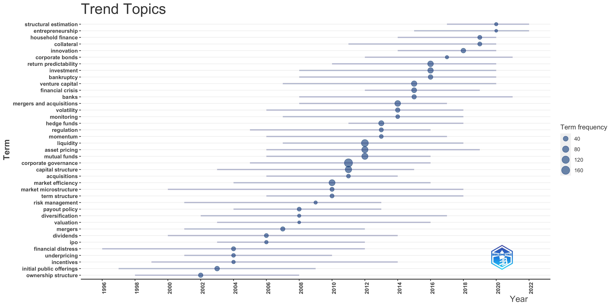{width="5.75in" height="2.875in"}
>
> 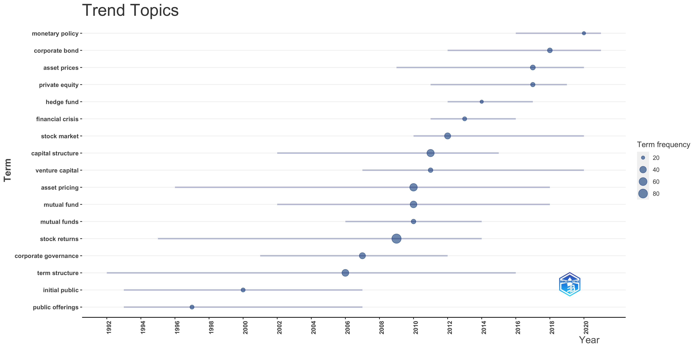{width="5.75in" height="2.875in"}

图：Trend Topics of JFE（Title词组），参数同表

> {width="5.75in" height="2.875in"}

参考文献：

[Household Finance - hhs.se - Stockholm School of Economics](https://www.hhs.se/en/houseoffinance/research/fields-of-research/household-finance/)

《Overview of Structural Estimation》 Toni M. Whited，2015

5.3.2 **Thematic Evolution**

**上升期热点主题**

> 共同基金（mutual funds）、对冲基金（hedge funds）、波动性（volatility）

**小众主题**

> 金融科技（fintech）、内部交易（insider trading）

**小众热门主题**

家庭金融（household finance）

**基础性但进展缓慢的主题**

> 流动性（liquidity）、金融危机（Financial crisis）、破产（bankruptcy）；
>
> 公司治理（Corporate governance）、资产结构（capital structure）、收购合并（mergers and acquisition）；
>
> 资产定价（asset pricing）、收益预测（return predictability）、市场有效性（market efficiency）

**萌芽主题**

> 量化宽松（quantitative easing）

图：Thematic Evolution of JFE - Author\'s keywords - 2012年-2022年

> 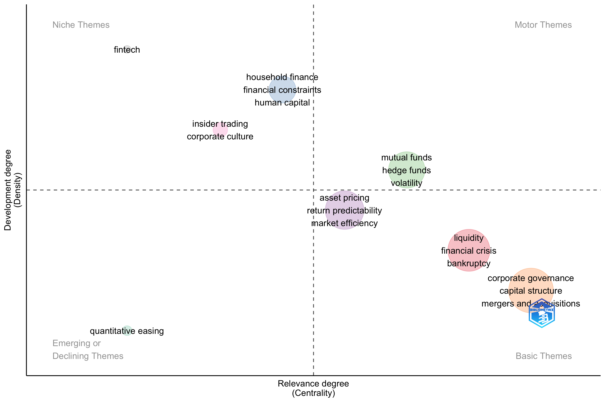{width="5.75in" height="3.8333333333333335in"}

表：Thematic Evolution of JFE - Author\'s keywords - 2012年-2022年

> 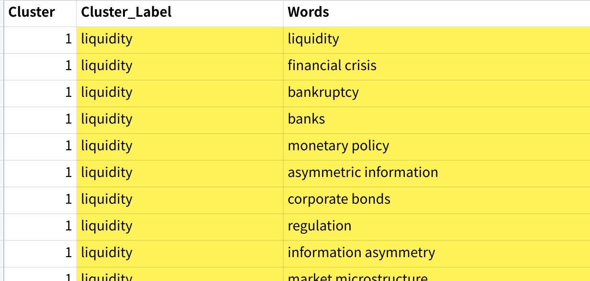
>
> **点击图片可查看完整电子表格**

5.4 **重要的知识概念组**

5.4.1 **Thematic Map**

借助Thematic Map，了解期刊中概念组，借此了解学科的研究方向，这些学者是通过哪些维度研究的。一共有五个知识组，其中最大的主要是Corporate Governance（绿色）、Liquidity（蓝色），前者是公司金融和组织分类下最受关注的领域，后者是应资本市场和资产定价分类下，最受关注的领域。

**知识组1：公司管理**

公司治理（Corporate Governance）下，最关注的知识主要是公司治理（corporate Governance）、资本结构（capital structure）、杠杆（leverage）、高管薪酬（executive compensation）、机构投资者（institutional investors）、创新（innovation）、所有权结构（ownership structure）、银行（banking）、监控（monitoring）、激励（incentives）、合并收购（mergers and acquisitions）。

参考共现网络分析，将公司治理细分为公司治理和资本结构。

其中，公司治理相关，主要研究

公司外部融资相关：风投（Venture Capital）、合并收购（Mergers&Acquisitions）、私募股权（Private Equity）

公司内部管理相关：董事会（Board of Directors）、所有权机构（ownership structure ）、监管（mornitoring）、高管薪酬（executive compensation）、对冲（Hedging）。高管薪酬主要和对冲相关。

其中，资本结构相关，主要研究

融资杠杆：杠杆（leverage）、抵押物（collateral）、融资约束（financial constraints）。

财务困境：财务危机（financial distress）、破产（bankruptcy）。

**知识组2：流动性**

流动性（Liquidity）下，最关注的知识主要是市场有效性（market efficiency）、资产定价（asset pricing）、对冲基金（hedge funds）、共同基金（mutual funds）、收益预测（return predictiability）、信息不对称（asymmetric information）、波动性（volatility）、行为金融学（behavioral finance）、期权（options）、错误定价（mispricing）、公司表现（firm performance）。

参考共现网络分析，流动性下，可细分为：

监管（regulation），监管和银行两个主题紧密相关。

金融机构相关：对冲基金（hedge funds）、共同基金（mutual funds）、银行（banks）

市场有效性相关：异常现象（anomalies）、波动性（volatility）、市场微观结构（market microstructure）、动量投资（momentum）、资产定价（asset pricing）、收益预测（return predictability）

行为金融学（Behavioral Finance）

**知识组3：投资**

投资（Investment紫色）下，主要研究金融危机（financial crisis）、破产（bankruptcy）、财务危机（financial distress）、扩散（contagion）、银行（banks）、抵押品（collateral）。

**知识组4：期限结构**

期限结构（Term Structure）下，主要研究期限结构（Term Structure）、股权溢价（Equity premium）。

**知识组5：股息**

股息（Dividends）下，主要研究股息（Dividends）、配息政策（payout policy）。

图，Thematic Map of JFE

> 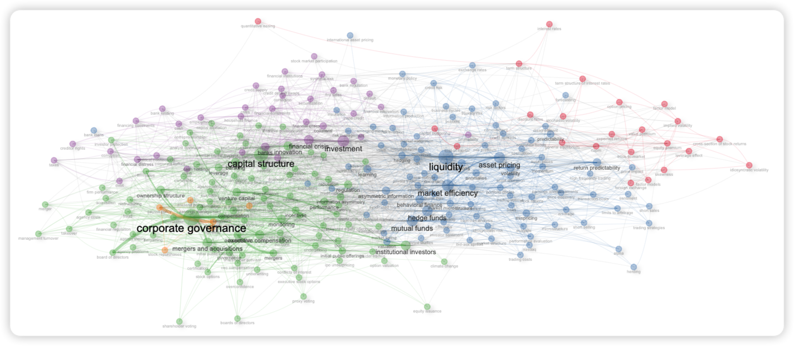{width="5.75in" height="2.5in"}

图，Co-occurrence Network of JFE - Author\'s Keywords

> 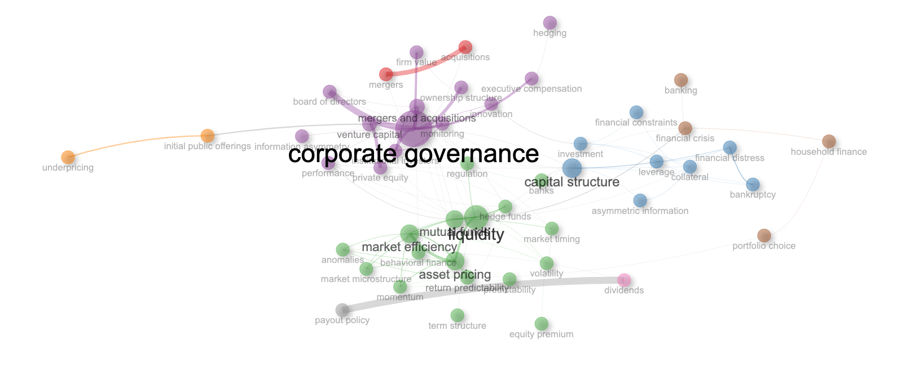{width="5.75in" height="2.40625in"}

其他发现：

公司管理（Corporate Governance）和流动性（Liquidity）都关注信息不对称（asymmetric information）。

6\. **一些清单**

6.1 **期刊历年获奖文献**

6.1.1 **1997年至2021年历史获奖文献清单 - Jensen Prize**

| 年份 | First Place Winners | Second Place Winner |
|---|---|---|
| 1997 | **The complexity of compensation contracts** Stacey R. Kole (Volume 43, Issue 1, January 1997, pages 79-104) **The decline of takeovers and disciplinary managerial turnover** Wayne H. Mikkelson and M. Megan Partch (Volume 44, Issue 2, May 1997, pages 205-228) |  |
| 1998 | **Risk management, capital budgeting, and capital structure policy for financial institutions: an integrated approach** Kenneth A. Froot and Jeremy C. Stein (Volume 47, Issue 1, January 1998, pages 55-82) | **Why firms issue convertible bonds: the matching of financial and real investment options** David Mayers (Volume 47, Issue 1, January 1998, pages 83-102) |
| 1999 | **The determinants and implications of corporate cash holdings** Tim Opler, Lee Pinkowitz, René M. Stulz and Rohan Williamson (Volume 52, Issue 1, April 1999, pages 3-46) | **Deregulation and the adaptation of governance structure: The case of the U.S. Airline industry** Stacey R. Kole and Kenneth Lehn (Volume 52, Issue 1, April 1999, pages 79-117) **Measuring investment distortions arising from stockholder-bondholder conflicts** Robert Parrino and Michael S. Weisbach (Volume 53, Issue 1, July 1999, pages 3-42) |
| 2000 | **On the optimality of resetting executive stock options** Viral V. Acharya, Kose John and Rangarajan K. Sundaram (Volume 57, Issue 1, July 2000, pages 65-101) | **Investor protection and corporate governance** Rafael La Porta, Florencio Lopez-de-Silanes Andrei Shleifer and Robert Vishny (Volume 58, Issue 1-2, October 2000, pages 3-27) |
| 2001 | **The theory and practice of corporate finance: Evidence from the field** John R.Graham and Campbell R. Harvey (Volume 60, Issue 2-3, May/June 2001, pages 187-243) | **Disappearing dividends: changing firm characteristics or lower propensity to pay?** Eugene F. Fama and Kenneth R. French (Volume 60, Issue 1, April 2001, pages 3-43) |
| 2002 | **Does diversification destroy value? Evidence from industry shocks** Owen A. Lamont and Christopher Polk (Volume 63, Issue 1, January 2002, pages 51-77) | **Investor protection and equity markets** Andrei Shleifer and Daniel Wolfenzon (Volume 66, Issue 1, October 2002, pages 3-27) |
| 2003 | **Stock market driven acquisitions** Andrei Shleifer and Robert W. Vishny (Volume 70, Issue 3, December 2003, pages 295-311) | **Testing the pecking order theory of capital structure** Murray Z. Frank and Vidhan K. Goyal (Volume 67, Issue 2, February 2003, pages 217-248) |
| 2004 | **Are dividends disappearing? Dividend concentration and the consolidation of earnings** Harry DeAngelo, Linda DeAngelo, and Douglas J. Skinner (Volume 72, Issue 3, June 2004, pages 425-456) | **Is the IPO pricing process efficient?** Michelle Lowry and G. William Schwert (Volume 71, Issue 1, January 2004, pages 3-26) |
| 2005 | **Payout policy in the 21st century** Alon Brav, John Graham, Roni Michaely, and Campbell R. Harvey (Volume 77, Issue 3, September 2005, pages 483-527) | **The effect of external finance on the equilibrium allocation of capital** Heitor Almeida, and Daniel Wolfenzon (Volume 75, Issue 1, January 2005, pages 133-164) |
| 2006 | **Tax shelters and corporate debt policy** John R. Graham and Alan L. Tucker (Volume 81, Issue 3, September 2006, pages 563-594) | **Are perks purely managerial excess?** Raghuram G. Rajan and Julie Wulf (Volume 79, Issue 1, January 2006, pages 1-33) **Profitability, investment and average returns** Eugene F. Fama and Kenneth R. French (Volume 82, Issue 3, December 2006, pages 491-518) |
| 2007 | **Does backdating explain the stock price pattern around executive stock option grants?** Randall A. Heron and Erik Lie (Volume 83, Issue 2, February 2007, pages 271-295) | **Theft and taxes** Mihir A. Desai, Alexander Dyck, and Luigi Zingales (Volume 84, Issue 3, June 2007, pages 591-623) **Financial fraud, director reputation, and shareholder wealth** Eliezer M. Fich and Anil Shivdasani (Volume 86, Issue 2, November 2007, pages 306-336) |
| 2008 | **Why do private acquirers pay so little compared to public acquirers?** Leonce L. Bargeron, Frederik P. Schlingemann, René M. Stulz, and Chad J. Zutter (Volume 89, Issue 3, September 2008, pages 375-390) | **Managerial incentives, capital reallocation, and the business cycle** Andrea L. Eisfeldt, and Adriano A. Rampini (Volume 87, Issue 1, January 2008, pages 177-199) |
| 2009 | **Share issuance and cross-sectional returns: International evidence** R. David McLean, Jeffrey Pontiff, and Akiko Watanabe (Volume 94, Issue 1, October 2009, Pages 1-17) | **Are elite universities losing their competitive edge?** E. Han Kim, Adair Morse, and Luigi Zingales (Volume 93, Issue 3, September 2009, Pages 353-381) |
| 2010 | **The marketing of seasoned equity offerings.** Xiaohui Gao and Jay Ritter (Volume 97, Issue 1, July 2010, Pages 33-52) | **Seasoned equity offerings, market timing, and the corporate lifecycle** Harry DeAngelo, Linda DeAngelo, and René M. Stulz (Volume 95, Issue 3, March 2010, Pages 275-295) |
| 2011 | **Ownership structure and the cost of corporate borrowing** Chen Lin, Yue Ma, Paul Malatesta, and Yuhai Xuan (Volume 100, Issue 1, April 2011, Pages 1-23) | **The causes and consequences of venture capital stage financing** Xuan Tian (Volume 101, Issue 1, July 2011, Pages 132-159) |
| 2012 | **Securitized banking and the run on repo** Gary Gorton and Andrew Metrick (Volume 104, Issue 3, June 2012, Pages 425-451) | **Cash flows and leverage adjustments** Michael Faulkender, Mark J. Flannery, Kristine Watson Hankins, and Jason M. Smith (Volume 103, Issue 3, March 2012, Pages 632-646) **The effect of reference point prices on mergers and acquisitions** Malcolm Baker, Xin Pan, and Jeffrey Wurgler (Volume 106, Issue 1, October 2012, Pages 49-71) |
| 2013 | **Managerial attitudes and corporate actions** John Graham, Campbell R. Harvey, and Manju Puri (Volume 109, Issue 1, July 2013, Pages 103-121) **Do personal taxes affect capital structure: Evidence from the 2003 tax cut** Leming Lin and Mark Flannery (Volume 109, Issue 2, August 2013, Pages 549-565) |  |
| 2014 | **Firm boundaries matter: Evidence from conglomerates and R&D activity** Amit Seru (Volume 111, Issue 2, February 2014, Pages 381-405) | **Refinancing, profitability and capital structure** Andras Danis, Daniel A. Rettl, and Toni M. Whited (Volume 114, Issue 3, December 2014, Pages 424-443) |
| 2015 | **A century of capital structure: The leveraging of corporate America** John R. Graham, Mark T. Leary, and Michael R. Roberts (Volume 118, Issue 3, December 2015, Pages 658-683) | **Lost in translation? The effect of cultural values on mergers around the world** Kenneth R. Ahern, Daniele Daminelli, and Cesare Fracassi (Volume 117, Issue 1, July 2015, Pages 165-189) |
| 2016 | **Target revaluation after failed takeover attempts - Cash versus stock** Ulrike M. Malmendier, Marcus Opp, and Farzad Saidi (Volume 119, Issue 1, January 2016, Pages 92-106) | **The ownership and trading of debt claims in Chapter 11 restructurings** Victoria Ivashina, Benjamin Iverson, and David C. Smith (Volume 119, Issue 2, February 2016, Pages 316-335) |
| 2017 | **The U.S. listing gap** Craig Doidge, G. Andrew Karolyi, and René M. Stulz (Volume 123, Issue 3, March 2017, Pages 464-487) | **Growth through rigidity: An explanation for the rise in CEO pay** Kelly Shue and Richard R. Townsend (Volume 123, Issue 1, January 2017, Pages 1-21) **Are corporate inversions good for shareholders?** Anton Babkin, Brent Glover, and Oliver Levine (Volume 126, Issue 2, November 2017, Pages 227-251) |
| 2018 | **How does hedge fund activism reshape corporate innovation?** Alon Brav, Wei Jiang, Song Ma, and Xuan Tian (Volume 130, Issue 2, November 2018, Pages 237-264) | **Fintech, regulatory arbitrage, and the rise of shadow banks** Greg Buchak, Gregor Matvos, Tomasz Piskorski, and Amit Seru (Volume 130, Issue 3, December 2018, Pages 453-483) |
| 2019 | **What\'s in a (school) name? Racial discrimination in higher education bond markets** Casey Dougal, Pengjie Gao, William J. Mayew, and Christopher A. Parsons (Volume 134, Issue 3, December 2019, Pages 570-590) | **Are lemons sold first? Dynamic signaling in the mortgage market** Manuel Adelino, Kristopher Gerardi, and Barney Hartman-Glaser (Volume 132, Issue 1, April 2019, Pages 1-25) |
| 2020 | **How do venture capitalists make decisions?** Paul Gompers, Will Gornall, Steven Kaplan, and Ilya A. Strebulaev (Volume 135, Issue 1, January 2020, Pages 169-190) | **Invest ideology** Patrick Bolton, Tao Li, Enrichetta Ravina, and Howard Rosenthal (Volume 137, Issue 2, August 2020, Pages 320-352) |
| 2021 | **Does common ownership really increase firm coordination?** Katharina Lewellen and Michelle Lowry (Volume 141, Issue 1, July 2021, Pages 322-344 135) | **Family comes first: Reproductive health and the gender gap in entrepreneurship** Jonathan Zandberg (Volume 140, June 2021, Pages 838-864) |
6.1.2 **1997年至2021年历史获奖文献清单 - Fama-DFA Prize**

| 年份 | First Place Winners | Second Place Winner |
|---|---|---|
| 1997 | **Detecting long-run abnormal stock returns: The empirical power and specification of test-statistics** Brad M. Barber and John D. Lyon (Volume 43, Issue 3, March 1997, pages 341-372) | **Analyzing investments whose histories differ in length** Robert F. Stambaugh (Volume 45, Issue 3, September 1997, pages 285-331) |
| 1998 | **Market efficiency, long-term returns, and behavioral finance** Eugene F. Fama (Volume 49, Issue 3, September 1998, pages 283-306) | **Alternative factor specifications, security characteristics, and the cross-section of expected stock returns** Michael J. Brennan Tarun Chordia and Avanidhar Subrahmanyam (Volume 49, Issue 3, September 1998, pages 345-373) **An empirical analysis of NYSE specialist trading** Ananth Madhavan and George Sofianos (Volume 48, Issue 2, May 1998, pages 189-210) |
| 1999 | **Bank entry, competition and the market for corporate securities underwriting** Amar Gande, Manju Puri and Anthony Saunders (Volume 54, Issue 2, November 1999, pages 165-195) | **Predictive regressions** Robert F. Stambaugh (Volume 54, Issue 3, December 1999, pages 375-421) |
| 2000 | **Commonality in liquidity** Tarun Chordia, Richard Roll and Avanidhar Subrahmanyam (Volume 56, Issue 1, April, 2000, pages 3-28) | **Herding among security analysts** Ivo Welch (Volume 58, Issue 3, December 2000, pages 369-396) |
| 2001 | **Following the leader: a study of individual analysts earnings forecasts** Rick A. Cooper, Theodore E. Day and Craig M. Lewis (Volume 61, Issue 3, September 2001, pages 383-416) | **Forecasting crashes: Trading volume, past returns and conditional skewness in stock prices** Joseph Chen, Harrison Hong and Jeremy C. Stein (Volume 61, Issue 3, September 2001, pages 345-381) |
| 2002 | **Breadth of ownership and stock returns** Joseph Chen, Harrison Hong and Jeremy C. Stein (Volume 66, Issue 2-3, November 2002, pages 171-205) | **Mutual fund performance and seemingly unrelated assets** Lubos Pastor and Robert F. Stambaugh (Volume 63, Issue 3, March 2002, pages 315-349) |
| 2003 | **The great reversals: The politics of financial development in the twentieth century** Raghuram G. Rajan and Luigi Zingales (Volume 69, Issue 1, July 2003, pages 5-50) | **A multivariate model of strategic asset allocation** John Y. Campbell, Yeung Lewis Chan and Luis M. Viceira (Volume 67, Issue 1, January 2003, pages 41-80) **Voting with their feet: Institutional ownership changes around forced CEO turnover** Robert Parrino, Richard W. Sias and Laura T. Starks (Volume 68, Issue 1, April 2003, pages 3-46) |
| 2004 | **Why are foreign firms listed in the U.S. worth more?** Craig Doidge, G. Andrew Karolyi, and René M. Stulz (Volume 71 Issue 2, February 2004, pages 205-238) | **New lists: Fundamentals and survival rates** Eugene F. Fama and Kenneth R. French (Volume 73, Issue 2, August 2004, pages 229-269) |
| 2005 | **Asset pricing with liquidity risk** Viral V. Acharya and Lasse Heje Pedersen (Volume 77 Issue 2, August 2005, pages 375-410) | **The risk and return of venture capital** John H. Cochrane (Volume 75, Issue 1, January 2005, pages 3-52) |
| 2006 | **The conditional CAPM does not explain asset-pricing anomalies** Jonathan Lewellen and Stefan Nagel (Volume 82, Issue 2, November 2006, pages 289-314) | **Was there a Nasdaq bubble in the last 1990s?** Lubos Pastor and Pietro Veronesi (Volume 81, Issue 1, July 2006, pages 61-100) **The other January effect** Michael J. Cooper, John J. McConnell, and Alexei V. Ovtcinnikov (Volume 82, Issue 2, November 2006, pages 315-341) |
| 2007 | **Laddering in initial public offerings** Grace Qing Hao (Volume 85, Issue 1, July 2007, pages 102-122) | **Does industry-wide distress affect defaulted firms? Evidence from creditor recoveries** Viral V. Acharya, Sreedhar T. Bharath, and Anand Srinivasan (Volume 85, Issue 3, September 2007, pages 787-821) **Optimism and economic choice** Manju Puri and David T. Robinson (Volume 86, Issue 1, October 2007, pages 71-99) |
| 2008 | **Inter-firm linkages and the wealth effects of financial distress along the supply chain** Michael G. Hertzel, Zhi Li, Micah S. Officer, and Kimberly J. Rodgers (Volume 87, Issue 2, February 2008, pages 374-387) | **Venture capital investment cycles: the impact of public markets** Paul Gompers, Anna Kovner, Josh Lerner, and David Scharfstein (Volume 87, Issue 1, January 2008, pages 1-23) **Dumb money: mutual fund flows and the cross-section of stock returns** Andrea Frazzini and Owen A. Lamont (Volume 88, Issue 2, May 2008, pages 299-322) |
| 2009 | **Why is PIN priced?** Jefferson Duarte and Lance Young (Volume 91, Issue 2, February 2009, Pages 119-138) | **Do liquidity measures measure liquidity?** Ruslan Y. Goyenko, Craig W. Holden, and Charles A. Trzcinka (Volume 92, Issue 2, May 2009, Pages 153-181) |
| 2010 | **The good news in short interest** Ekkehart Boehmer, Zsuzsa R. Huszar, and Bradford Jordan (Volume 96, Issue 1, April 2010, Pages 80-97) | **A skeptical appraisal of asset-pricing tests** Jonathan Lewellen, Stefan Nagel, and Jay Shanken (Volume 96, Issue 2, May 2010, Pages 175-194) |
| 2011 | **Corporate bond default risk: A 150-year perspective** Kay Giesecke, Francis A. Longstaff, Stephen Schaefer, and Ilya A. Strebulaev (Volume 102, Issue 2, November 2011, Pages 233-250) | **Do hedge funds trade on private information? Evidence from syndicated lending** Nadia Massoud, Debarshi Nandy, Anthony Saunders, and Keke Song (Volume 99, Issue 3, March 2011, Pages 477-499) |
| 2012 | **Is momentum really momentum?** Robert Novy-Marx (Volume 103, Issue 3, March 2012, Pages 429-453) | **Friends with money** Joseph Engelberg, Pengjie Gao, and Christopher A. Parsons (Volume 103, Issue 1, January 2012, Pages 169-188) |
| 2013 | **The other side of value: The gross profitability premium** Robert Novy-Marx (Volume 108, Issue 1, April 2013, Pages 1-28) | **Anomalies and financial distress** Doron Avramov, Tarun Chordia, Gergana Jostova, and Alexander Philipov (Volume 108, Issue 1, April 2013, Pages 139-159) **Legislating stock prices** Lauren Cohen, Karl Diether, and Christopher J. Malloy (Volume 110, Issue 3, December 2013, Pages 574-595) |
| 2014 | **Betting against beta** Andrea Frazzini and Lasse H. Pedersen (Volume 111, Issue 1, January 2014, Pages 1-25) | **Limited partner performance and the maturing of the private equity industry** Berk A. Sensoy, Yingdi Wang, and Michael S. Weisbach (Volume 112, Issue 3, June 2014, Pages 320-343) |
| 2015 | **Scale and skill in active management** Lubos Pastor, Robert F. Stambaugh, and Lucian A. Taylor (Volume 116, Issue 1, April 2015, Pages 23-45) | **Juicing the dividend yield: Mutual funds and the demand for dividends** Lawrence E. Harris, Samuel M. Hartzmark, and David H. Solomon (Volume 116, Issue 3, June 2015, Pages 433-451) |
| 2016 | **Systemic risk and the macroeconomy: An empirical evaluation** Stefano Giglio, Bryan T. Kelly, and Seth Pruitt (Volume 119, Issue 3, March 2016, Pages 457-471) | **Momentum crashes** Kent D. Daniel and Tobias J. Moskowitz (Volume 122, Issue 2, November 2016, Pages 221-247) |
| 2017 | **Information networks: Evidence from illegal insider trading tips** Kenneth R. Ahern (Volume 125, Issue 1, July 2017, Pages 26-47) | **Skill and luck in private equity performance** Arthur G. Korteweg and Morten Sorensen (Volume 124, Issue 3, June 2017, Pages 535-562) |
| 2018 | **An intertemporal CAPM with stochastic volatility** John Y. Campbell, Stefano Giglio, Christopher Polk, and Robert Turley (Volume 128, Issue 2, May 2018, Pages 207-233) | **Carry** Ralph S.J. Koijen, Tobias J. Moskowitz, Lasse Heje Pedersen, and Evert B. Vrugt (Volume 127, Issue 2, February 2018, Pages 197-225) |
| 2019 | **Characteristics are covariances: A united model of risk and return** Bryan T. Kelly, Seth Pruitt, and Yinan Su (Volume 134, Issue 3, December 2019, Pages 501-524.) | **Bubbles for Fama** Robin Greenwood, Andrei Shleifer, and Yang You (Volume 131, Issue 1, January 2019, Pages 20-43.) |
| 2020 | **Shrinking the cross section** Serhiy Kozak, Stefan Nagel, and Shrihari Santosh (Volume 135, Issue 2, February 2020, Pages 271-292.) | **Betting against correlation: Testing theories of the low-risk effect** Clifford S. Asness, Andrea Frazzini, Niels Joachim Gormsen, and Lasse H. Pedersen (Volume 135, Issue 3, March 2020, Pages 629-652.) |
| 2021 | **Sustainable investing in equilibrium** Ľuboš Pástor, Robert F. Stambaugh, and Lucian A. Taylor (Volume 142, November 2021, Pages 550-571) | **Robust benchmark design** Darrell Duffie and Piotr Dworczak (Volume 142, November 2021, Pages 775-802) |
6.2 **期刊引用最多的文献**

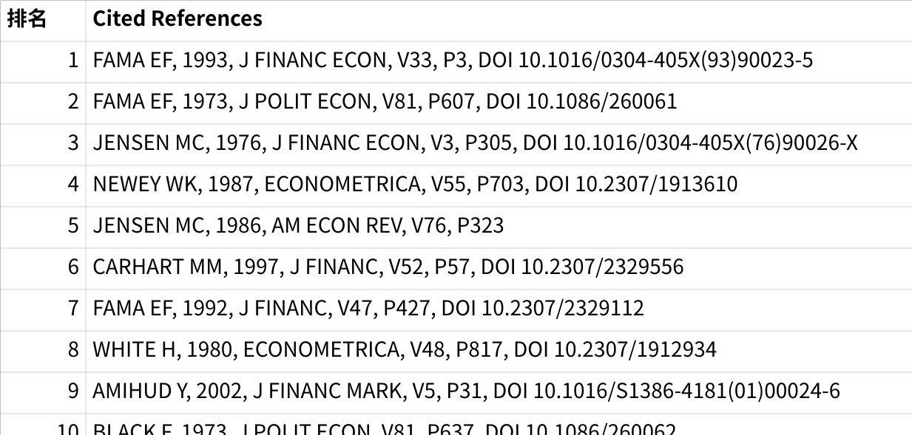

**点击图片可查看完整电子表格**

6.3 **期刊中介中心性高的文献**

参考中介中心性，代表文献的价值程度，中介中心性最高的前十如下。

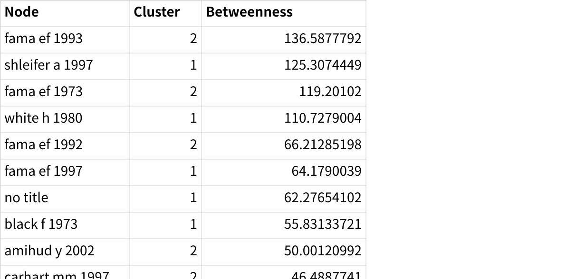

**点击图片可查看完整电子表格**

7\. **小结**

《金融经济学》是一本充满活力的期刊。

白手起家，顺势而为，勇于变革，创造未来。用创新和实证，吹响了现代金融的号角。

随着1980年代的那批拓者们退居幕后，2021年，现任主编上任，从第一批打天下的老将们手中接过重任。新一代的学者们举起了现代金融的探索大旗。历经了90年代、2000年代的世界范围金融危机，经历着COVID-19全球范围的影响，随着人工智能等技术的发展，未来的金融会走向何方，会有什么样的变革？

也许，这个答案就在《金融经济学》期刊中。

8\. **分析思路**

8.1 **分析过程**

8.1.1 **信息获取**

选用的信息源为WOS的核心数据库，期刊标题搜索"Journal of Financial Economics"，时间限定1974-2022，获得1976-2022数据总计3430篇，包含论文、议事文件、较正、评论文章。经统计缺少1974-1976数据，且部分论文缺失摘要。决定用Dimension数据来看论文与摘要，bibliometrix仍用WOS数据进行分析。

交叉验证选取了以下数据集，并统计数据集网络边界如下。

> 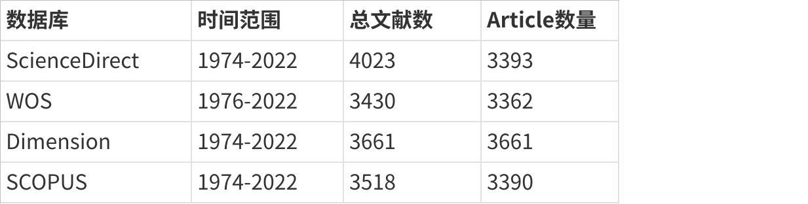
>
> **点击图片可查看完整电子表格**

8.1.2 **信息整理**

数据集导入Zotero并检查元数据完整性和准确性，清洗、查漏补缺，用高级检索分类。

8.1.3 **信息加工**

数据集打包，导入Biblimetrix计量分析，筛选Article、English、1976-2022年。先根据大纲确认了加工目标，了解期刊发展史，挖掘关键人物、知识。根据目标，参考时间、空间、变量三类的加工模式，加工信息，建立认知。

信息加工的时候，发现Bibliometrix中，不同维度、模式的加工结果，可以相互进行交叉验证。同时，获得的认知，反过来通过检索，可以获取相应的定性信息，交叉验证，或者建立进一步认知。

8.1.4 **信息报告**

根据加工的信息，整理成文。以结论在前，加工数据证据在后的形式呈现。

8.2 **使用的工具或数据库**

数据库：WOS、Dimensions

工具：Zotero、Bibliometrix

9\. **讨论或建议**

9.1 **问题和优化**

基于Bibliometrix的计量分析，得出部分结论。结论相对表象，还可以进一步深挖，目前时间不够，后续可以继续补充挖掘。报告之后，路演之前，可以先简单挖掘Fama-French的模型，用在路演。

缺乏编程技能，有部分加工被限制。比如，想要爬取Almetric数据，github上找到了Python包，奈何不会用，故放弃。因此，没能得出传播广的文献和有趣的文献。后续可以简单补一下调用方法。暂时用其他思路尝试计算学者的有趣度。因时间关系，暂时没有应用在文献有趣度计算。后续可以尝试补充。

本来大纲中还安排了几个加工思路，也是时间不够，暂时放弃。比如，期刊大纲变化分析。

9.2 **收获：建立工具思维**

9.2.1 **Bibliometrix**

表格和图表，合并使用，更容易获得认知。

有的数据还有其他用途，比如，Author\'s Production Over Time的表格，用来检索作者、期刊内发文，读取引用数，还可以直接跳转到官网文献页面，十分方便。外加浏览器翻译功能，在这些信息调取上，比Zotero好用。

部分信息加工，如果需要获取时间阶段，内置参数设置没有的时候，巧用开始时的Filters就好。

9.2.2 **Zotero**

快速调取和阅读文献的时候，Zotero PDF Translate 和 Zotero PDF Preview插件可以提高效率。

10\. **Changelog**

2023-01-30 川子，完成大纲，梁同学整理zoteto期刊论文数据、清洗、核对、分组。

2023-02-05知了，完成期刊发展史部分

2023-02-07 川子，完成重要知识部分的加工，梁同学完成现任主编，获取重要学者信息，完成信息网络边界。

2023-02-08 川子，完成阶段重要学者、主题重要学者加工，梁同学获取Bibliometrix学者部分图表，并进行填充。

2023-02-09 川子，完成华人之星挖掘，修改完善部分成文，增加部分结论和补充信息，梁同学获取学者合作网络论文并分组。知了，填充重要学者信息。

2023-02-10 川子，填充分析思路、讨论建议、完善中介中心性、有趣度分析，完成报告结论，整体报告成文修改、格式排版完善，梁同学填充信息整理、获取fama模型资料、完成学科影响力。知了完成报告路演ppt初始版本。

2023-02-11 川子，最后检查排版格式，微修定稿。
