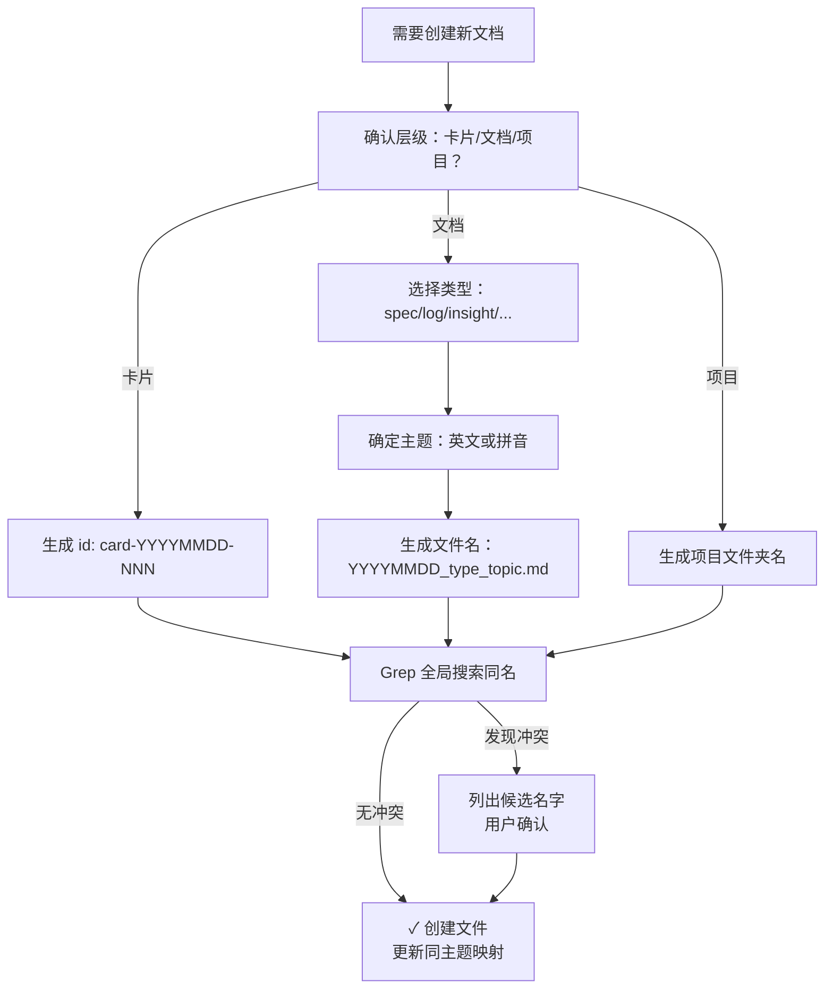

# 全局命名规约 (Naming Convention Specification)

**目的**：建立统一的编码体系，避免全局范围的文件名冲突和混淆，使 AI 能精准定位和管理文件。

**适用范围**：本项目的所有文件、文件夹和卡片。

---

## 一、三层编码体系

### 第1层：卡片级（Card Level）

**定义**：单个想法、笔记或洞察的最小单元。

**编码格式**：
```yaml
---
id: card-<YYYYMMDD>-<序号3位>
---
```

**示例**：
```yaml
---
id: card-20260203-001
type: insight
title: 文件冲突问题分析
tags: [naming, file-management]
---
```

**规则**：
- 日期：`YYYYMMDD` 格式，表示创建日期
- 序号：3位数字，从 001 开始，同日期内递增
- **全局唯一性**：整个项目中的 id 不允许重复
- **不可改变**：一旦分配，永不更改（即使文件移动或内容修改）

**用途**：
- 单个想法的身份证号
- 便于跨文档引用（如 "@card-20260203-001"）
- 便于去重和追踪演化

---

### 第2层：文档级（Document Level）

**定义**：中等粒度的知识单元，通常 1-5 千字。

**编码格式**：
```
<YYYYMMDD>_<type>_<topic>.md
```

**示例**：
```
2026-02-03_spec_naming-convention.md     # 规约文档
2026-01-09_log_why-abandon-playwright.md # 决策日志
2026-02-03_insight_file-conflicts.md     # 洞察卡片
2026-01-17_template_video-script.md      # 模板
2026-02-03_guide_claude-workflow.md      # 工作流指南
```

**类型（type）选项**：
| 类型 | 说明 | 示例 |
|------|------|------|
| `spec` | 规约/规范文档 | naming-convention, api-design |
| `log` | 决策日志、技术回顾 | why-abandon-playwright, problem-analysis |
| `insight` | 洞察、想法、反思 | file-conflicts, ai-collaboration |
| `template` | 模板、示例、样本 | video-script, prompt-template |
| `guide` | 工作流指南、使用说明 | claude-workflow, data-collection |
| `report` | 分析报告、统计数据 | file-audit, naming-conflicts |
| `note` | 笔记、记录（不常用） | meeting-notes, brainstorm |

**规则**：
- **日期必填**：文档的创建日期（`YYYYMMDD`）
- **类型必填**：上表中的任一类型
- **主题必填**：简洁、可读的英文或中文拼音，用 `-` 连接（如 `file-conflicts`, `why-abandon-playwright`）
- **全局唯一性**：`<日期>_<类型>_<主题>` 的组合全局唯一
- **文件名中不加版本号**：版本由日期和序号控制

**用途**：
- 中等粒度的知识单元
- 便于 AI 通过文件名推断内容
- 便于按日期或类型检索
- 便于快速定位同主题的文件

**示例对比**：
```
❌ 坏的做法：
   naming.md                    # 模糊，类型不清
   naming_v1.md, naming_v2.md   # 版本号应由日期控制
   2026-02-03-命名规约.md       # 主题用中文不易搜索

✅ 好的做法：
   2026-02-03_spec_naming-convention.md
   2026-02-04_spec_naming-convention.md
   2026-02-03_log_naming-discussion.md
```

---

### 第3层：项目级（Project Level）

**定义**：超大粒度的工作单元，整个项目文件夹。

**编码格式**：
```
<project-name>-<module>-<phase>
```

**示例**：
```
v3-2026-2-03-spec-sync          # YouTube 视频平台 v3 - 规约同步阶段
youtube-research-202601          # YouTube 研究项目 - 2026年1月版本
yt-analysis-baseline-phase1      # YouTube 数据分析 - 基线阶段
```

**规则**：
- **项目名**：简洁的英文（如 `v3`, `youtube-research`）
- **模块名**：功能模块或子域（如 `spec-sync`, `data-analysis`）
- **阶段名**（可选）：项目周期（如 `phase1`, `baseline`, `2026-02-03`）
- **用 `-` 连接**：便于路径解析
- **小写字母**：保持一致性

---

## 二、冲突预防规则

### 禁区清单（绝对不允许）

| 禁止事项 | 例子 | 后果 |
|----------|------|------|
| 同目录完全重名 | 同时有 `naming.md` 和 `naming.md`（完全相同）| 一个会覆盖另一个 |
| 同名不同扩展但易混淆 | `naming.md` 和 `naming.txt`（都是说明）| 人眼混淆，不知道用哪个 |
| 缺少日期的自创文档 | `naming-convention.md`（无日期）| 无法追踪版本演化 |
| 缺少类型标记 | `2026-02-03_naming.md`（无类型）| AI 和人都无法推断用途 |
| 不规范格式 | `2026/02/03_spec_naming.md` | 破坏编码约定，难以搜索 |

### 必做事项（强制执行）

**创建新文件前的 5 步检查**：

```
Step 1: 确认编码规约
        ↓
        文件属于哪一层？(卡片/文档/项目)

Step 2: 用 Grep 全局搜索
        ↓
        grep -r "filename_pattern" .

Step 3: 检查同主题文件
        ↓
        是否存在相同主题的其他版本？

Step 4: 确认日期和序号
        ↓
        日期是否正确？序号是否递增？

Step 5: 获得人类确认
        ↓
        列出所有候选名字，用户选择 ✓
```

**AI 的强制检查代码**：
```python
def validate_filename(filename: str, layer: str) -> bool:
    """
    验证文件名是否符合规约

    Args:
        filename: 文件名
        layer: 所属层级 ('card' | 'document' | 'project')

    Returns:
        True if valid, False otherwise
    """
    if layer == 'card':
        # 卡片级：YAML 元数据中的 id 格式
        pattern = r'^card-\d{8}-\d{3}$'
    elif layer == 'document':
        # 文档级：YYYYMMDD_type_topic.md
        pattern = r'^\d{8}_(spec|log|insight|template|guide|report|note)_[a-z0-9-]+\.md$'
    elif layer == 'project':
        # 项目级：project-module-phase
        pattern = r'^[a-z0-9-]+$'

    return bool(re.match(pattern, filename))
```

---

## 三、约定俗成文件名保护

### 特殊地位的文件（不遵循编码规约）

以下文件是 **AI 和工具生态的约定俗成**，必须保持原名不改，即使它们不符合 `YYYYMMDD_type_topic.md` 格式：

#### Category 1：AI 识别的核心文件

| 文件名 | 类型 | 为什么不能改 | 识别者 |
|--------|------|-----------|--------|
| `README.md` | 说明 | 几乎所有工具都默认查找 README 来理解项目 | GitHub, Claude Code, 各种自动工具 |
| `.42cog/` | 目录 | 认知敏捷法的标准目录结构 | Claude Code, 知识大法 |
| `meta.md` | 规约 | 认知敏捷法的标准文件 | Claude Code, 知识大法 |
| `cog.md` | 规约 | 认知敏捷法的标准文件 | Claude Code, 知识大法 |
| `real.md` | 规约 | 认知敏捷法的标准文件 | Claude Code, 知识大法 |
| `spec/` | 目录 | spec 规约的标准位置 | Claude Code, skill 系统 |
| `work.md` | 日志 | 认知敏捷法的历史档案 | Claude Code, 知识大法 |

#### Category 2：工具链的约定俗成

| 文件名 | 类型 | 为什么不能改 | 识别者 |
|--------|------|-----------|--------|
| `.gitignore` | 配置 | Git 默认查找这个文件 | Git, GitHub |
| `.claudeignore` | 配置 | Claude Code 默认查找这个文件 | Claude Code |
| `package.json` | 配置 | npm/bun 默认查找这个文件 | Node.js 生态 |
| `pyproject.toml` | 配置 | Python 生态标准配置 | Python 生态 |

#### Category 3：Skill 和 Agent 相关

| 文件名 | 类型 | 为什么不能改 | 识别者 |
|--------|------|-----------|--------|
| `.42cog/skills/` | 目录 | skill 注册的标准位置 | Claude Code |
| `*.skill.md` | 后缀 | skill 文件的标准后缀 | Claude Code skill 系统 |

### 规则

✅ **必须保持原名**：
- `.42cog/` 下的所有文件和目录
- 所有工具链约定俗成的文件 (README, .gitignore, package.json 等)
- Skill 文件的 `.skill.md` 后缀

❌ **可以改名的文件**：
- 项目自定义的文档 (遵循 `YYYYMMDD_type_topic.md` 规约)
- 用户创建的笔记和卡片
- 数据文件和输出产物

### 示例：混合策略

```
项目结构（符合规约和约定俗成的混合）

project-root/
├─ README.md                          ← 约定俗成，不改
├─ .gitignore                         ← 约定俗成，不改
├─ .claudeignore                      ← 约定俗成，不改
├─ package.json                       ← 约定俗成，不改
├─ .42cog/                            ← 约定俗成，不改
│  ├─ meta/
│  │  └─ meta.md                      ← 约定俗成，不改
│  ├─ cog/
│  │  └─ cog.md                       ← 约定俗成，不改
│  ├─ real/
│  │  └─ real.md                      ← 约定俗成，不改
│  ├─ spec/                           ← 约定俗成，不改
│  │  └─ dev/
│  │     └─ sys.spec.md               ← spec 子目录，遵循习惯
│  ├─ work/
│  │  └─ work.md                      ← 约定俗成，不改
│  └─ skills/
│     └─ check-naming-violations.skill.md  ← .skill.md后缀，约定俗成
│
├─ 2026-02-03_spec_naming-convention.md    ← 遵循新规约✓
├─ 2026-02-03_report_naming-audit.md       ← 遵循新规约✓
└─ 2026-02-03_log_optimization-complete.md ← 遵循新规约✓
```

### 对编码规约的影响

编码规约的适用范围修正为：

```
编码规约适用范围:

├─ 文档级编码 (YYYYMMDD_type_topic.md)
│  └─ 应用于: 项目自创的文档、笔记、报告、洞察
│  └─ 不应用于: .42cog/* 下的文件
│
├─ 卡片级编码 (id: card-YYYYMMDD-NNN)
│  └─ 应用于: YAML 元数据中的卡片编码
│  └─ 不应用于: 约定俗成的工具配置文件
│
└─ 项目级编码 (<name>-<module>-<phase>)
   └─ 应用于: 项目文件夹名
   └─ 不应用于: .42cog 等标准目录
```

## 三、异常处理

### 情况 1：需要多个同名文件（不同版本）

**解决方案**：使用版本号后缀

```
❌ 错误做法：
   naming-convention.md
   naming-convention-v1.md
   naming-convention-final.md

✅ 正确做法：
   2026-02-03_spec_naming-convention.md
   2026-02-04_spec_naming-convention.md  ← 次日更新版本
```

**关键点**：版本由**日期控制**，不是 v1/v2。同一日期内需要多版本时：

```
2026-02-03_spec_naming-convention_v1.md
2026-02-03_spec_naming-convention_v2.md
```

但建议改用日期区分，如：
```
2026-02-03_spec_naming-convention.md
2026-02-04_log_naming-discussion.md     ← 第二天讨论的结果
```

### 情况 2：子文件夹中的同名文件

**问题**：
```
project/
  ├── module-a/
  │   └── README.md      ← 模块A的说明
  └── module-b/
      └── README.md      ← 模块B的说明
      ↑ 两个 README.md 冲突！
```

**解决方案**：在文件名中包含父上下文

```
✅ 正确做法：
project/
  ├── module-a/
  │   └── 2026-02-03_guide_module-a-setup.md
  └── module-b/
      └── 2026-02-03_guide_module-b-setup.md
```

### 情况 3：临时文件或中间产物

**规则**：临时文件也必须遵循命名规约，不允许 `temp`, `tmp`, `test` 等无意义名字

```
❌ 禁止：
   temp.md
   test-file.md
   draft_v2.txt

✅ 允许：
   2026-02-03_log_draft-naming-proposal.md
   2026-02-03_template_test-video-analysis.md
```

---

## 四、同主题文件关系映射

当同一主题下有多个文件时，**必须**在 `cog.md#同主题文件关系映射` 中标注关系。

### 映射表格式

```markdown
| 主题 | 文件 | 创建日期 | 状态 | 关系说明 |
|------|------|----------|------|----------|
| 编码规约 | 2026-02-03_spec_naming-convention.md | 2026-02-03 | active | 详细的全局规约 |
| 编码规约 | meta.md#编码规约 | 2026-02-03 | active | meta.md 中的简化版 |
| 编码规约 | real.md#文件名冲突禁区 | 2026-02-03 | active | 禁区清单，作为 real 约束 |
```

### 关键字段说明

| 字段 | 说明 | 示例 |
|------|------|------|
| 主题 | 文件所属的知识主题 | 编码规约、AI 协作流程 |
| 文件 | 完整的文件路径或内部锚点 | `2026-02-03_spec_naming-convention.md` |
| 创建日期 | 文件的创建日期 | `2026-02-03` |
| 状态 | 文件的生命周期状态 | `active` / `deprecated` / `archived` |
| 关系说明 | 与其他文件的关系 | "详细版本"、"简化摘要"、"实施指南" |

---

## 五、工作流集成

### 创建新文档的完整流程



### AI 的检查清单

创建任何文件前，AI **必须**执行：

```python
def pre_create_file_checklist(filename: str, layer: str) -> Dict[str, Any]:
    """
    创建文件前的强制检查清单
    """
    checks = {
        "1_format_valid": validate_filename(filename, layer),
        "2_no_global_duplicate": grep_global_search(filename) == 0,
        "3_same_topic_mapped": check_mapping_table(topic),
        "4_metadata_complete": has_required_metadata(),
        "5_user_confirmed": user_confirmation_received(),
    }

    if not all(checks.values()):
        failed = [k for k, v in checks.items() if not v]
        raise FileCreationError(f"检查失败: {failed}")

    return checks
```

---

## 六、查询和检索

### 按类型检索

```bash
# 查找所有规约文档
find . -name "*_spec_*.md"

# 查找 2026-02 期间的所有决策日志
find . -name "202602*_log_*.md"

# 查找特定主题的所有版本
grep -l "naming" *.md | sort
```

### 按日期追踪演化

```bash
# 查看编码规约的演化历史
ls -lt *spec_naming-convention*.md

# 输出示例：
# 2026-02-04_spec_naming-convention.md
# 2026-02-03_spec_naming-convention.md
```

### 按关键词搜索

```bash
# 查找与文件冲突相关的所有文档
grep -r "conflict\|duplicate\|collision" . --include="*.md"
```

---

## 七、版本历史

| 版本 | 日期 | 变更内容 |
|------|------|----------|
| 1.0 | 2026-02-03 | 初始化三层编码体系、冲突预防规则、异常处理 |

---

## 八、常见问题

### Q1: 如果不小心违反了规约怎么办？

**A**:
1. 立即停止工作
2. 用 `git checkout` 或手动删除违规文件
3. 按规约重新创建
4. 在同主题映射表中记录错误版本为 `deprecated`

### Q2: 旧项目中的文件没有遵循规约怎么办？

**A**:
从现在开始逐步迁移：
1. 不强制修改现有文件（避免版本混乱）
2. 新创建的文件严格遵循规约
3. 在同主题映射表中标记旧文件为 `deprecated`
4. 创建新的规约版本文件（如 `2026-02-03_spec_naming-convention.md`）

### Q3: 卡片级文档需要遵循编码规约吗？

**A**:
卡片级有两种情况：

**情况 1：独立卡片文件** → 遵循文档级规约
```
2026-02-03_insight_file-conflicts.md
```

**情况 2：嵌入在其他文档中的卡片** → 使用卡片级 id
```yaml
---
id: card-20260203-001
type: insight
---
```

### Q4: 如何处理跨项目的同名文件？

**A**:
不同项目文件夹是隔离的。只要项目文件夹名不同，可以有同名文档：

```
project-a/2026-02-03_spec_naming-convention.md  ✓
project-b/2026-02-03_spec_naming-convention.md  ✓
```

但建议在同主题映射表中标注项目上下文。

---

## 附录：快速参考

### 编码模板

```bash
# 卡片级
id: card-20260203-001

# 文档级
2026-02-03_spec_naming-convention.md
2026-02-03_log_decision-rationale.md
2026-02-03_insight_problem-analysis.md
2026-02-03_template_script-format.md
2026-02-03_guide_workflow-steps.md
2026-02-03_report_audit-results.md

# 项目级
v3-2026-2-03-spec-sync
youtube-research-202601-baseline
```

### 合规检查 Checklist

```
□ 文件名包含日期（YYYYMMDD）？
□ 文件名包含类型标记（spec/log/insight/...）？
□ 文件名包含清晰的主题（英文或拼音）？
□ 用 Grep 检查了全局重名？
□ 同主题映射表已更新？
□ 日期和序号按顺序递增？
□ 没有使用 v1/v2 版本号？
□ 没有使用 temp/draft 等临时标记？
```

---

**作者**：Claude Code
**最后审核**：2026-02-03
**下次更新计划**：2026-02-10（基于实际使用反馈）
